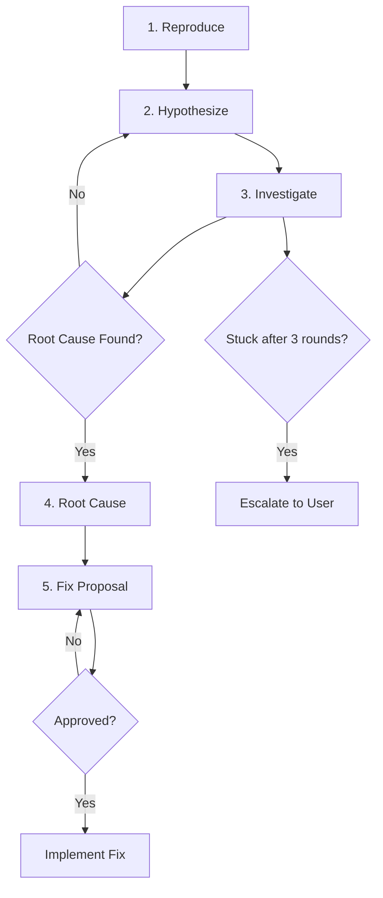
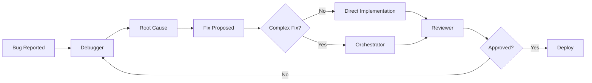

<Note>
  **Agent Type:** Systematic Debugging
  
  **Tools:** Read, Glob, Grep, Bash
  
  **Model:** opus (advanced reasoning)
  
  **Memory:** project (recalls previous bugs)
</Note>

## Overview

The Debugger agent performs methodical bug investigation that narrows down root causes before proposing fixes. It uses hypothesis-driven debugging, examines git history, searches for similar patterns, and proposes minimal fixes with clear rationale.

## When to Use

Use the Debugger agent when facing:

<CardGroup cols={2}>
  <Card title="Hard Bugs" icon="bug">
    Bugs that aren't immediately obvious or have unclear causes
  </Card>
  
  <Card title="Test Failures" icon="vial-circle-xmark">
    Failing tests that need systematic investigation
  </Card>
  
  <Card title="Runtime Errors" icon="circle-exclamation">
    Production errors or crashes requiring root cause analysis
  </Card>
  
  <Card title="Regressions" icon="arrow-rotate-left">
    Features that worked before but are now broken
  </Card>
</CardGroup>

## Configuration

```yaml
---
name: debugger
description: Specialized debugging agent. Use when facing hard bugs, test failures, or runtime errors that need systematic investigation.
tools: ["Read", "Glob", "Grep", "Bash"]
model: opus
memory: project
---
```

### Configuration Details

<ParamField path="model" type="string" default="opus">
  Uses Claude Opus for advanced reasoning in complex debugging scenarios
</ParamField>

<ParamField path="memory" type="string" default="project">
  Recalls previous bugs in the same area to identify patterns
</ParamField>

## Five-Step Workflow

The Debugger follows a systematic 5-step process:



### Step 1: Reproduce

<Note>
  **Objective:** Confirm the bug and capture exact error details
</Note>

<Steps>
  <Step title="Run the Failing Test">
    Execute the test or reproduce the error condition
  </Step>
  
  <Step title="Capture Error Details">
    Save exact error message, stack trace, and context
  </Step>
  
  <Step title="Classify Bug Type">
    Determine if this is a regression (worked before) or new behavior
  </Step>
</Steps>

<CodeGroup>
```bash Example: Test Failure
$ npm test -- user.test.ts

FAIL tests/user.test.ts
  ✕ should update user profile (52ms)

Error: Expected status 200, received 500
    at Object.<anonymous> (tests/user.test.ts:45:7)

Stack trace:
  at updateProfile (src/api/user.ts:89)
  at handler (server/routes/user.ts:34)

Type: Regression (test passed 3 days ago)
```

```bash Example: Runtime Error
Production error from logs:

TypeError: Cannot read property 'id' of undefined
    at getUserData (src/services/user.ts:142:15)
    at renderProfile (src/pages/Profile.tsx:28:9)

Context:
- User ID: 12345
- Timestamp: 2026-03-08 14:32:01
- Browser: Chrome 122

Type: New behavior (recent deploy)
```
</CodeGroup>

### Step 2: Hypothesize

<Note>
  **Objective:** Generate 2-3 ranked hypotheses about the cause
</Note>

Each hypothesis includes:
- **Likelihood** (percentage)
- **Evidence for** (what supports this)
- **Evidence against** (what contradicts this)
- **Test** (how to verify)

<CodeGroup>
```text Hypothesis Template
Hypothesis 1 (70%): [Most likely cause]
  Evidence for:
    - [Supporting fact 1]
    - [Supporting fact 2]
  Evidence against:
    - [Contradicting fact]
  Test:
    - [How to verify this hypothesis]

Hypothesis 2 (20%): [Alternative cause]
  Evidence for:
    - [Supporting fact]
  Evidence against:
    - [Contradicting fact]
  Test:
    - [How to verify]

Hypothesis 3 (10%): [Unlikely but possible]
  Evidence for:
    - [Supporting fact]
  Evidence against:
    - [Contradicting fact]
  Test:
    - [How to verify]
```

```text Real Example
Hypothesis 1 (70%): Profile API returns null for deleted users
  Evidence for:
    - Error says "Cannot read property 'id' of undefined"
    - Stack trace shows getUserData receives undefined
    - Recent feature allows user deletion
  Evidence against:
    - Test passes locally with mock data
  Test:
    - Check if user 12345 exists in database
    - Test with deleted user

Hypothesis 2 (20%): Database connection timeout
  Evidence for:
    - Error is intermittent
    - Production has higher load than dev
  Evidence against:
    - No timeout error in logs
    - Other queries working fine
  Test:
    - Check database connection pool metrics
    - Review query execution times

Hypothesis 3 (10%): Race condition in cache
  Evidence for:
    - Using Redis cache for user data
    - Error doesn't happen every time
  Evidence against:
    - Cache has TTL, should be fresh
  Test:
    - Disable cache and see if error persists
```
</CodeGroup>

### Step 3: Investigate

<Note>
  **Objective:** Test each hypothesis starting with the most likely
</Note>

<AccordionGroup>
  <Accordion title="Read Code Paths" icon="code">
    Examine the code involved in each hypothesis
    
    - Follow the stack trace
    - Read functions that could cause the issue
    - Check error handling and edge cases
  </Accordion>
  
  <Accordion title="Check Git History" icon="code-branch">
    Review recent changes to affected files
    
    ```bash
    git log --oneline --since="1 week ago" -- src/api/user.ts
    git blame src/api/user.ts
    git show <commit-hash>
    ```
    
    Recent changes are more likely to be the cause.
  </Accordion>
  
  <Accordion title="Search for Patterns" icon="magnifying-glass">
    Find similar code that works correctly
    
    - How do other APIs handle null users?
    - Are there similar patterns that don't fail?
    - What's different about the failing case?
  </Accordion>
  
  <Accordion title="Add Debug Output" icon="print">
    Add targeted logging if needed
    
    ```typescript
    console.log('User data:', user);
    console.log('User ID:', userId);
    ```
    
    But only as a last resort—prefer reading code first.
  </Accordion>
</AccordionGroup>

<CodeGroup>
```bash Investigation Example
Testing Hypothesis 1: Profile API returns null for deleted users

1. Checking database:
   $ psql -c "SELECT * FROM users WHERE id = 12345"
   (0 rows)
   
   ✓ User 12345 does not exist!

2. Reading getUserData code:
   src/services/user.ts:142
   
   const user = await db.findUser(userId);
   return user.id; // ← Error here if user is null
   
   ✓ No null check before accessing user.id

3. Checking git history:
   $ git log --oneline --since="1 week ago" -- src/services/user.ts
   
   abc1234 Add user deletion feature
   
   ✓ User deletion added 3 days ago, matches timeline

4. Checking similar code:
   src/services/admin.ts has:
   
   const user = await db.findUser(userId);
   if (!user) return null;
   return user.id;
   
   ✓ Other code properly checks for null

CONCLUSION: Hypothesis 1 confirmed!
Root cause: getUserData doesn't handle null user
```
</CodeGroup>

### Step 4: Root Cause

<Note>
  **Objective:** Present the confirmed root cause with details
</Note>

```text
ROOT CAUSE: [What's actually wrong]
WHERE: [file:line]
WHY: [How it got this way]
SINCE: [When it was introduced, if knowable]
```

<CodeGroup>
```text Example: User Profile Bug
ROOT CAUSE: getUserData doesn't handle deleted users
WHERE: src/services/user.ts:142
WHY: User deletion feature was added without updating dependent code
SINCE: Commit abc1234 (3 days ago, March 5th)

Details:
When a user is deleted, db.findUser(userId) returns null.
getUserData tries to access user.id without checking if user exists.
This throws "Cannot read property 'id' of undefined".

Other parts of the codebase (admin.ts) properly check for null,
but this code path was missed during the deletion feature implementation.
```

```text Example: Performance Bug
ROOT CAUSE: N+1 query in order processing
WHERE: src/services/order.ts:67
WHY: Loop fetches products one at a time instead of batch query
SINCE: Original implementation (present since v1.0)

Details:
For each order item, code calls db.getProduct(productId).
With 100 items, this makes 100 separate database queries.
This causes timeout under high load.

Should fetch all products in a single batch query.
```
</CodeGroup>

### Step 5: Fix Proposal

<Note>
  **Objective:** Propose the minimal fix with clear rationale
</Note>

```text
FIX: [Description of the fix]
CHANGES:
  - file.ts:42 - [What to change]
  - file.test.ts:10 - [Test changes]
RISK: [low/medium/high]
TESTS: [How to verify the fix]
```

<CodeGroup>
```text Example: User Profile Fix
FIX: Add null check before accessing user properties

CHANGES:
  - src/services/user.ts:142 - Add null check
    Before:
      const user = await db.findUser(userId);
      return user.id;
    
    After:
      const user = await db.findUser(userId);
      if (!user) return null;
      return user.id;
  
  - tests/services/user.test.ts:89 - Add deleted user test
    Test that getUserData returns null for deleted users

RISK: Low
- Minimal change, follows existing patterns
- Other code already returns null for missing users
- Backward compatible (null is expected return type)

TESTS:
1. Existing tests should still pass
2. New test: getUserData with deleted user ID returns null
3. Manual: Profile page shows "User not found" instead of crashing
```

```text Example: Performance Fix
FIX: Replace N+1 query with single batch fetch

CHANGES:
  - src/services/order.ts:67 - Use batch query
    Before:
      for (const item of order.items) {
        item.product = await db.getProduct(item.productId);
      }
    
    After:
      const productIds = order.items.map(i => i.productId);
      const products = await db.getProducts(productIds);
      const productMap = new Map(products.map(p => [p.id, p]));
      for (const item of order.items) {
        item.product = productMap.get(item.productId);
      }
  
  - src/db/products.ts - Add getProducts batch method

RISK: Medium
- Changes core order processing logic
- Need to ensure products are matched correctly
- getProducts method needs proper testing

TESTS:
1. Performance test: 100-item order completes in <100ms
2. Unit test: Products correctly matched to items
3. Edge case: Some products missing from database
4. Load test: No timeout under high concurrency
```
</CodeGroup>

<Warning>
  Debugger waits for approval before implementing the fix.
</Warning>

## Rules and Constraints

<AccordionGroup>
  <Accordion title="Never Guess" icon="ban">
    The Debugger investigates systematically. No random fixes or "shotgun debugging."
  </Accordion>
  
  <Accordion title="Find Root Cause First" icon="magnifying-glass">
    Never apply fixes without confirming the root cause. Fixing symptoms doesn't solve the problem.
  </Accordion>
  
  <Accordion title="Check Git Blame" icon="code-branch">
    Recent changes are more likely to be the cause. Always check git history.
  </Accordion>
  
  <Accordion title="Use Project Memory" icon="brain">
    Recall previous bugs in the same area to identify patterns.
  </Accordion>
  
  <Accordion title="Escalate When Stuck" icon="arrow-up">
    After 3 investigation rounds without finding root cause, escalate to user with findings.
  </Accordion>
  
  <Accordion title="Capture Learnings" icon="graduation-cap">
    Document debugging insights using `[LEARN] Debugging: <insight>` syntax.
  </Accordion>
</AccordionGroup>

## Anti-Patterns to Avoid

<Warning>
  The Debugger actively avoids these common mistakes:
</Warning>

<CardGroup cols={2}>
  <Card title="Shotgun Debugging" icon="gun" color="#ef4444">
    **Don't:** Change random things hoping something works
    
    **Do:** Form hypothesis, test systematically
  </Card>
  
  <Card title="Ignoring Stack Traces" icon="scroll" color="#ef4444">
    **Don't:** Skip over stack traces—they're noise
    
    **Do:** Stack traces tell you exactly where to look
  </Card>
  
  <Card title="Not Reproducing First" icon="play" color="#ef4444">
    **Don't:** Start fixing before confirming the bug
    
    **Do:** Always reproduce first—you can't fix what you can't see
  </Card>
  
  <Card title="Fixing Symptoms" icon="bandage" color="#ef4444">
    **Don't:** Apply quick fixes to symptoms
    
    **Do:** Find and fix the root cause
  </Card>
</CardGroup>

## Example Debugging Session

<CodeGroup>
```text Full Debugging Session
User: The user profile page is crashing in production

=== STEP 1: REPRODUCE ===

Reproducing error...
Checking production logs...

Error found:
TypeError: Cannot read property 'id' of undefined
    at getUserData (src/services/user.ts:142:15)
    at renderProfile (src/pages/Profile.tsx:28:9)

User ID: 12345
Timestamp: 2026-03-08 14:32:01

Running test locally...
Test passes with existing user.
Test fails with user ID that doesn't exist.

Classification: Regression
- Feature worked before
- Started 3 days ago after user deletion feature deployed

=== STEP 2: HYPOTHESIZE ===

Hypothesis 1 (70%): getUserData doesn't handle deleted users
  Evidence for:
    - Error message indicates undefined user object
    - User deletion feature added recently
    - Error only happens for specific user IDs
  Evidence against:
    - Should have been caught in testing
  Test:
    - Check if user 12345 exists in database
    - Read getUserData implementation

Hypothesis 2 (20%): Cache returning stale data
  Evidence for:
    - Using Redis for user data
    - Deletion might not invalidate cache
  Evidence against:
    - Cache has 5min TTL, user deleted 2 days ago
  Test:
    - Check cache invalidation on user deletion

Hypothesis 3 (10%): Database replication lag
  Evidence for:
    - Using read replicas
  Evidence against:
    - Lag is typically < 1s, user deleted days ago
  Test:
    - Query primary database directly

=== STEP 3: INVESTIGATE ===

Testing Hypothesis 1...

Checking database:
$ psql production -c "SELECT * FROM users WHERE id = 12345"
(0 rows)

✓ User 12345 does not exist

Reading getUserData code:
src/services/user.ts:142

export async function getUserData(userId: number) {
  const user = await db.findUser(userId);
  return user.id; // ← No null check!
}

✓ Code doesn't handle null user

Checking git history:
$ git log --oneline --since="1 week ago" -- src/services/user.ts

abc1234 Add user deletion feature
xyz5678 Update type definitions

$ git show abc1234

+ async function deleteUser(userId: number) {
+   await db.users.delete({ id: userId });
+ }

✓ Deletion feature added but dependent code not updated

Searching for similar patterns:
$ grep -r "db.findUser" src/

src/services/admin.ts:
const user = await db.findUser(userId);
if (!user) return null;
return user.id;

✓ Other code properly checks for null!

Hypothesis 1 confirmed.

=== STEP 4: ROOT CAUSE ===

ROOT CAUSE: getUserData doesn't handle deleted users
WHERE: src/services/user.ts:142
WHY: User deletion feature added without updating dependent code
SINCE: Commit abc1234 (March 5th, 2026)

Explanation:
When a user is deleted via the new deleteUser function,
db.findUser(userId) returns null. getUserData attempts to
access user.id without checking if user exists, causing
the TypeError.

Other parts of the codebase (e.g., admin.ts) properly
handle the null case, but this code path was missed
during the deletion feature implementation.

=== STEP 5: FIX PROPOSAL ===

FIX: Add null check before accessing user properties

CHANGES:
  src/services/user.ts:142
    Before:
      export async function getUserData(userId: number) {
        const user = await db.findUser(userId);
        return user.id;
      }
    
    After:
      export async function getUserData(userId: number) {
        const user = await db.findUser(userId);
        if (!user) return null;
        return user.id;
      }
  
  tests/services/user.test.ts:89
    Add test case:
      it('returns null for deleted user', async () => {
        const result = await getUserData(99999);
        expect(result).toBeNull();
      });

RISK: Low
- Minimal change following existing patterns
- Backward compatible (null is valid return type)
- Matches how other services handle missing users

TESTS:
1. Run existing test suite (should all pass)
2. New test: getUserData with non-existent user returns null
3. Manual: Visit profile page for deleted user, should show 404
4. Check Profile.tsx handles null return value gracefully

Waiting for approval...

User: approved

Implementing fix...
src/services/user.ts updated ✓
tests/services/user.test.ts updated ✓

Running tests...
All tests pass ✓

Fix complete!

[LEARN] Debugging: Always check git blame for recent changes in error area
[LEARN] Debugging: When adding deletion features, search for all usages
[LEARN] Convention: All db.find* calls should check for null before accessing properties
```
</CodeGroup>

## Best Practices

<Steps>
  <Step title="Reproduce First">
    Always start by confirming you can reproduce the bug. You can't fix what you can't see.
  </Step>
  
  <Step title="Read Stack Traces">
    Stack traces tell you exactly where the error occurred. Start your investigation there.
  </Step>
  
  <Step title="Check Recent Changes">
    Use `git blame` and `git log` to find recent changes. Regressions are often recent.
  </Step>
  
  <Step title="Form Hypotheses">
    Don't randomly try fixes. Form clear hypotheses and test them systematically.
  </Step>
  
  <Step title="Find Root Cause">
    Don't stop at symptoms. Find the actual root cause before proposing fixes.
  </Step>
  
  <Step title="Minimal Fixes">
    Propose the smallest fix that addresses the root cause. Don't over-engineer.
  </Step>
</Steps>

## Integration with Other Agents



<Tip>
  For complex fixes, hand off to Orchestrator for multi-phase implementation. For simple fixes, implement directly then run through Reviewer.
</Tip>

## Comparison with Other Agents

| Feature | Debugger | Reviewer | Orchestrator |
|---------|----------|----------|---------------|
| **Purpose** | Find root cause | Quality checks | Build features |
| **Timing** | When bugs occur | Before commit | During development |
| **Approach** | Hypothesis-driven | Checklist-based | Phase-gated |
| **Output** | Root cause + fix | Issue list | Working feature |
| **Makes changes** | Yes (with approval) | No | Yes |

## Troubleshooting

<AccordionGroup>
  <Accordion title="Can't Reproduce Bug" icon="circle-question">
    If you can't reproduce the error:
    - Check production logs for more context
    - Verify environment differences (data, config, versions)
    - Try with production data snapshot
    - May be intermittent—capture more occurrences
  </Accordion>
  
  <Accordion title="Multiple Possible Causes" icon="code-branch">
    If several hypotheses seem equally likely:
    - Investigate the one with easiest test first
    - Use git blame to find recent changes
    - Check which hypothesis matches similar bugs
    - May be multiple bugs—fix one at a time
  </Accordion>
  
  <Accordion title="Root Cause Still Unclear" icon="magnifying-glass">
    After 3 investigation rounds without clarity:
    - Debugger escalates to you with findings
    - May need domain knowledge or external context
    - Consider pair debugging session
    - Document what's been ruled out
  </Accordion>
  
  <Accordion title="Fix Seems Too Complex" icon="diagram-nested">
    If the proposed fix is large or risky:
    - Hand off to Orchestrator for multi-phase implementation
    - May indicate architectural issue, not simple bug
    - Consider if this should be a refactoring task
  </Accordion>
</AccordionGroup>

## Next Steps

<CardGroup cols={2}>
  <Card title="Reviewer" icon="clipboard-check" href="/agents/reviewer">
    Quality review after fixing bugs
  </Card>
  
  <Card title="Orchestrator" icon="diagram-project" href="/agents/orchestrator">
    Multi-phase implementation for complex fixes
  </Card>
</CardGroup>