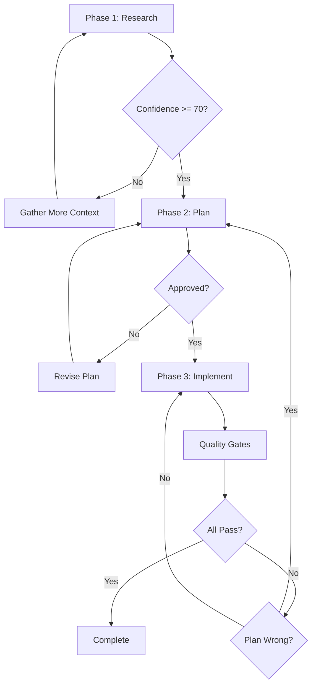
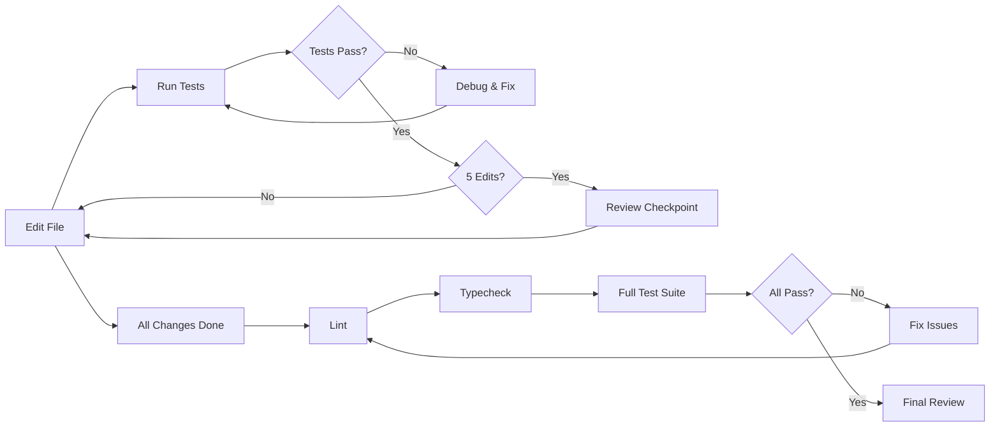

<Note>
  **Agent Type:** Multi-Phase Development
  
  **Tools:** Read, Glob, Grep, Bash, Edit, Write
  
  **Skills:** pro-workflow
  
  **Model:** opus (advanced reasoning)
  
  **Memory:** project (recalls previous work)
</Note>

## Overview

The Orchestrator agent builds features through three validated phases: Research, Plan, and Implement. Each phase must pass validation gates before proceeding to the next. Orchestrator uses advanced reasoning and project memory to deliver high-quality implementations.

## When to Use

<Warning>
  Use Orchestrator **PROACTIVELY** for:
</Warning>

<CardGroup cols={2}>
  <Card title="Multi-File Features" icon="files">
    Building features that touch more than 5 files
  </Card>
  
  <Card title="Architecture Decisions" icon="sitemap">
    Features requiring architectural design choices
  </Card>
  
  <Card title="Complex Features" icon="diagram-nested">
    Features with unclear requirements or dependencies
  </Card>
  
  <Card title="Quality-Critical Work" icon="certificate">
    Features where quality and correctness are paramount
  </Card>
</CardGroup>

## Configuration

```yaml
---
name: orchestrator
description: Multi-phase development agent. Research > Plan > Implement with validation gates. Use PROACTIVELY when building features that touch >5 files or require architecture decisions.
tools: ["Read", "Glob", "Grep", "Bash", "Edit", "Write"]
skills: ["pro-workflow"]
model: opus
memory: project
---
```

### Configuration Details

<ParamField path="model" type="string" default="opus">
  Uses Claude Opus for advanced reasoning and complex decision-making
</ParamField>

<ParamField path="memory" type="string" default="project">
  Maintains project memory to recall patterns from previous feature builds
</ParamField>

<ParamField path="skills" type="array">
  Loads the `pro-workflow` skill for advanced development patterns
</ParamField>

## Three-Phase Workflow



## Phase 1: Research (GO/NO-GO)

<Note>
  **Objective:** Explore the codebase to assess feasibility and build confidence
</Note>

### Research Workflow

<Steps>
  <Step title="Find Relevant Files">
    Search for all files and patterns related to the task
  </Step>
  
  <Step title="Check Dependencies">
    Identify dependencies and constraints that affect implementation
  </Step>
  
  <Step title="Identify Patterns">
    Find existing patterns in the codebase to follow
  </Step>
  
  <Step title="Score Confidence">
    Rate readiness 0-100 across five dimensions
  </Step>
</Steps>

### Confidence Scoring

Orchestrator scores confidence across five dimensions (0-20 points each):

<AccordionGroup>
  <Accordion title="Scope Clarity (0-20)" icon="bullseye">
    **Question:** Do you know exactly what files need to change?
    
    - 20: Know all files, all changes
    - 10-15: Know most files, some uncertainty
    - 0-5: Many unknowns, unclear scope
  </Accordion>
  
  <Accordion title="Pattern Familiarity (0-20)" icon="clone">
    **Question:** Does the codebase have similar patterns to follow?
    
    - 20: Clear patterns exist, well-documented
    - 10-15: Some patterns, need adaptation
    - 0-5: No patterns, creating from scratch
  </Accordion>
  
  <Accordion title="Dependency Awareness (0-20)" icon="diagram-project">
    **Question:** Do you know what depends on the code being changed?
    
    - 20: Full dependency graph understood
    - 10-15: Major dependencies known
    - 0-5: Dependencies unknown, high risk
  </Accordion>
  
  <Accordion title="Edge Case Coverage (0-20)" icon="triangle-exclamation">
    **Question:** Can you identify the edge cases?
    
    - 20: All edge cases enumerated
    - 10-15: Major edge cases known
    - 0-5: Edge cases unclear
  </Accordion>
  
  <Accordion title="Test Strategy (0-20)" icon="vial">
    **Question:** Do you know how to verify changes?
    
    - 20: Complete test strategy defined
    - 10-15: Basic test approach clear
    - 0-5: Testing approach unclear
  </Accordion>
</AccordionGroup>

### GO/NO-GO Decision

<CodeGroup>
```text Score >= 70: GO to Planning
Research complete. Confidence: 85/100

Dimensions:
  Scope clarity:        18/20 ✓
  Pattern familiarity:  17/20 ✓
  Dependency awareness: 16/20 ✓
  Edge case coverage:   17/20 ✓
  Test strategy:        17/20 ✓

VERDICT: GO
Proceeding to Phase 2: Planning
```

```text Score < 70: Gather More Context
Research incomplete. Confidence: 58/100

Dimensions:
  Scope clarity:        14/20 ~
  Pattern familiarity:   8/20 ✗
  Dependency awareness: 12/20 ~
  Edge case coverage:   12/20 ~
  Test strategy:        12/20 ~

Gaps identified:
- No existing authentication patterns found
- Unclear how sessions are managed
- Need to understand token storage

Gathering more context...
[Explores further]

Re-score: 74/100 - GO
```
</CodeGroup>

<Warning>
  If confidence < 70 after 2 rounds, Orchestrator escalates to you for guidance.
</Warning>

## Phase 2: Plan (Approval Required)

<Note>
  **Objective:** Design the solution and get approval before any code changes
</Note>

### Planning Output

```text
PLAN: Add User Profile Page with Avatar Upload

Goal: Allow users to view and edit their profile with avatar upload capability

Files to modify:
1. src/pages/Profile.tsx - Create profile page component
2. src/hooks/useProfile.ts - Profile data fetching and updates
3. src/components/AvatarUpload.tsx - Avatar upload component
4. src/api/profile.ts - Profile API endpoints
5. src/routes/index.ts - Add profile route
6. tests/pages/Profile.test.tsx - Profile page tests

New files:
1. src/types/profile.ts - Profile type definitions
2. server/routes/profile.ts - Server-side profile endpoints
3. server/middleware/upload.ts - File upload middleware

Approach:
1. Create profile type definitions (name, email, avatar, bio)
   - Rationale: Type safety across frontend and backend

2. Implement server endpoints first (GET/PUT /api/profile)
   - Rationale: Backend-first ensures API contract is solid

3. Add file upload middleware with validation
   - Rationale: Security and file size limits critical

4. Build AvatarUpload component following ImageUpload pattern
   - Rationale: Reuse existing upload patterns for consistency

5. Create Profile page with form and avatar upload
   - Rationale: User-facing UI last after backend is solid

6. Add tests for each layer
   - Rationale: Test as you build, not after

Risks:
- Large avatar files could impact performance
  Mitigation: 2MB file size limit, client-side image compression
  
- Avatar upload failures need graceful handling
  Mitigation: Show upload progress, retry on failure
  
- Concurrent profile updates could cause conflicts
  Mitigation: Optimistic locking with version field

Test strategy:
- Unit tests: Profile hooks, validation logic
- Integration tests: API endpoints with file upload
- E2E tests: Full profile update flow
- Edge cases: Large files, invalid formats, network errors

Estimated scope: Medium (2-3 hours)
```

### Approval Gate

<Warning>
  **CRITICAL:** Orchestrator waits for explicit approval before Phase 3.
</Warning>

Valid approval phrases:
- "proceed"
- "approved"
- "looks good"
- "go ahead"

<Tip>
  Review the plan carefully. This is your last chance to adjust before implementation.
</Tip>

## Phase 3: Implement

<Note>
  **Objective:** Execute the plan step by step with quality gates
</Note>

### Implementation Workflow

<Steps>
  <Step title="Execute in Order">
    Make changes in the sequence specified in the plan
  </Step>
  
  <Step title="Test After Each File">
    Run relevant tests after modifying each file
  </Step>
  
  <Step title="Review Checkpoints">
    Pause for review after every 5 edits
  </Step>
  
  <Step title="Quality Gates">
    After all changes: run lint, typecheck, and full test suite
  </Step>
  
  <Step title="Final Review">
    Present summary and findings for final review
  </Step>
</Steps>

### Quality Gates

Orchestrator runs quality checks throughout implementation:



### Review Checkpoints

Every 5 edits, Orchestrator pauses to:

<CardGroup cols={2}>
  <Card title="Show Progress" icon="chart-line">
    Report what's been completed and what remains
  </Card>
  
  <Card title="Validate Approach" icon="clipboard-check">
    Confirm implementation matches the plan
  </Card>
  
  <Card title="Check Quality" icon="shield-check">
    Verify tests pass and code quality is maintained
  </Card>
  
  <Card title="Get Feedback" icon="comments">
    Allow you to provide guidance or corrections
  </Card>
</CardGroup>

### Plan Deviation

<Warning>
  If implementation reveals the plan was wrong, Orchestrator returns to Phase 2.
</Warning>

```text
Implementation issue detected:
The existing session system uses Redis, not in-memory storage
as assumed in the plan. This changes the approach.

Returning to Phase 2 to revise plan...
```

## Project Memory

Orchestrator uses project memory to improve over time:

<AccordionGroup>
  <Accordion title="Recalls Patterns" icon="brain">
    Remembers successful patterns from previous feature builds
    
    Example: "Last time we added a form, we used react-hook-form and zod validation"
  </Accordion>
  
  <Accordion title="Learns from Bugs" icon="book">
    Records debugging insights for future reference
    
    Example: "[LEARN] Debugging: Always check Redis connection before querying"
  </Accordion>
  
  <Accordion title="Captures Decisions" icon="scale-balanced">
    Stores architectural decisions and rationale
    
    Example: "[LEARN] Architecture: We use REST for public APIs, GraphQL for admin"
  </Accordion>
  
  <Accordion title="Tracks Conventions" icon="scroll">
    Maintains coding conventions and style preferences
    
    Example: "[LEARN] Convention: Error messages go in src/constants/errors.ts"
  </Accordion>
</AccordionGroup>

### Learning Syntax

Orchestrator captures learnings using this syntax:

```text
[LEARN] Category: Insight

Examples:
[LEARN] Testing: Always mock Redis in unit tests
[LEARN] Architecture: Database migrations go in migrations/ folder
[LEARN] Performance: Cache API responses for 5 minutes
[LEARN] Security: Validate file types on both client and server
```

## Example Session

<CodeGroup>
```text Full Orchestrator Session
User: Add real-time notification system

=== PHASE 1: RESEARCH ===

Exploring codebase for notification patterns...
- Found WebSocket server in server/ws.ts
- Found notification UI in src/components/Notifications.tsx
- Found user subscription system in server/subscriptions/

Scoring confidence:
  Scope clarity:        17/20 ✓
  Pattern familiarity:  18/20 ✓
  Dependency awareness: 16/20 ✓
  Edge case coverage:   15/20 ✓
  Test strategy:        16/20 ✓

Confidence: 82/100 - GO

=== PHASE 2: PLAN ===

PLAN: Real-Time Notification System

Goal: Send and display real-time notifications using existing WebSocket infrastructure

Files to modify:
1. server/ws.ts - Add notification event handlers
2. server/subscriptions/notifications.ts - Notification subscription logic
3. src/components/Notifications.tsx - Real-time updates
4. src/hooks/useNotifications.ts - WebSocket notification hook
5. src/types/notification.ts - Notification types

Approach:
1. Define notification type: { id, userId, type, message, read, timestamp }
2. Add WebSocket event: 'notification:new'
3. Update subscription system to emit on new notifications
4. Create useNotifications hook with WebSocket listener
5. Update UI to show real-time notifications
6. Add mark-as-read functionality

Risks:
- User offline when notification sent
  Mitigation: Store in DB, send when reconnect
- Multiple tabs/devices per user
  Mitigation: Broadcast to all user's connections

Test strategy:
- Mock WebSocket in tests
- Test connection/disconnection handling
- Test mark-as-read updates

Estimated scope: Medium

Waiting for approval...

User: approved

=== PHASE 3: IMPLEMENT ===

[1/5] Creating notification types...
src/types/notification.ts written
Tests pass ✓

[2/5] Adding WebSocket handlers...
server/ws.ts updated
Integration tests pass ✓

[3/5] Implementing subscription logic...
server/subscriptions/notifications.ts updated
Tests pass ✓

[4/5] Creating useNotifications hook...
src/hooks/useNotifications.ts written
Unit tests pass ✓

[5/5] Updating Notifications UI...
src/components/Notifications.tsx updated
Component tests pass ✓

=== REVIEW CHECKPOINT ===
5/5 files complete
All tests passing ✓

=== QUALITY GATES ===
Running lint... ✓
Running typecheck... ✓
Running full test suite... ✓

=== COMPLETE ===

Implementation complete!

Summary:
✓ Real-time notifications working via WebSocket
✓ Handles offline users (stores in DB)
✓ Broadcasts to multiple devices
✓ Mark-as-read functionality
✓ All tests passing

[LEARN] Architecture: WebSocket notifications follow publish-subscribe pattern
[LEARN] Testing: Mock WebSocket with __mocks__/socket.io-client.ts
```
</CodeGroup>

## Rules and Constraints

<Warning>
  Orchestrator follows strict rules:
</Warning>

<AccordionGroup>
  <Accordion title="Never Skip Phases" icon="ban">
    Research before planning, plan before implementing. No shortcuts.
  </Accordion>
  
  <Accordion title="Never Proceed Without Approval" icon="hand">
    Wait for explicit approval between phases, especially before implementation.
  </Accordion>
  
  <Accordion title="Return to Planning If Wrong" icon="arrow-rotate-left">
    If implementation reveals plan issues, go back to Phase 2—don't forge ahead.
  </Accordion>
  
  <Accordion title="Use Project Memory" icon="brain">
    Recall patterns from previous work to maintain consistency.
  </Accordion>
  
  <Accordion title="Capture Learnings" icon="graduation-cap">
    Record insights for future reference using [LEARN] syntax.
  </Accordion>
</AccordionGroup>

## Best Practices

<Steps>
  <Step title="Use Proactively">
    Don't wait until you're stuck. Use Orchestrator from the start for complex features.
  </Step>
  
  <Step title="Trust the Process">
    Let Orchestrator complete each phase. Don't skip validation gates.
  </Step>
  
  <Step title="Review Plans Carefully">
    Phase 2 approval is critical. Scrutinize the plan before proceeding.
  </Step>
  
  <Step title="Leverage Memory">
    Reference previous implementations. Orchestrator learns from past work.
  </Step>
  
  <Step title="Capture Learnings">
    Document insights during implementation for future features.
  </Step>
</Steps>

## Comparison with Other Agents

| Feature | Orchestrator | Planner | Scout |
|---------|--------------|---------|-------|
| **Phases** | 3 (Research, Plan, Implement) | 1 (Plan only) | 1 (Research only) |
| **Makes changes** | Yes (Phase 3) | No | No |
| **Model** | Opus | Default | Default |
| **Memory** | Project | None | None |
| **Approval gates** | 2 (after Research, after Plan) | 1 (after Plan) | 0 |
| **Best for** | Complex features | Initial planning | Quick confidence check |

## Troubleshooting

<AccordionGroup>
  <Accordion title="Stuck in Research Phase" icon="circle-notch">
    If confidence score keeps < 70:
    - Task may be too complex or unclear
    - Provide more context about requirements
    - Break task into smaller pieces
    - Consider using Planner for human-guided exploration
  </Accordion>
  
  <Accordion title="Plan Seems Wrong" icon="circle-xmark">
    If the plan doesn't look right:
    - Don't approve—ask for revisions
    - Provide specific feedback about concerns
    - Reference similar features that should be followed
    - Orchestrator will revise and re-present
  </Accordion>
  
  <Accordion title="Implementation Deviates from Plan" icon="code-branch">
    If implementation doesn't match the plan:
    - This is normal—plans aren't perfect
    - Orchestrator will return to Phase 2 to revise
    - Trust the process—adaptive planning is a feature
  </Accordion>
  
  <Accordion title="Tests Failing" icon="vial-circle-check">
    If tests fail during implementation:
    - Orchestrator will debug and fix
    - If root cause suggests plan issue, returns to Phase 2
    - Review checkpoints help catch issues early
  </Accordion>
</AccordionGroup>

## Next Steps

<CardGroup cols={2}>
  <Card title="Debugger" icon="bug" href="/agents/debugger">
    Systematic debugging when issues arise
  </Card>
  
  <Card title="Reviewer" icon="clipboard-check" href="/agents/reviewer">
    Quality review after implementation
  </Card>
</CardGroup>