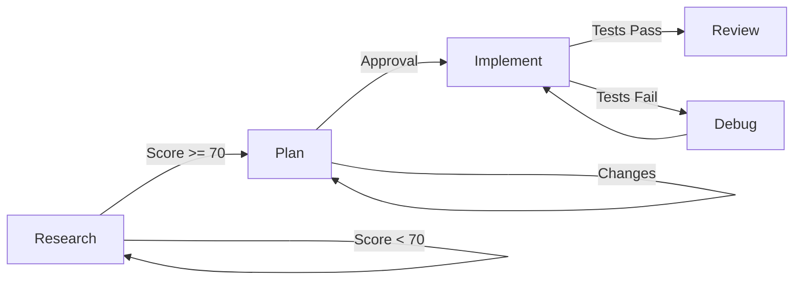

OpenCode Pro includes specialized agents designed for complex multi-phase workflows. Each agent has specific tools, skills, and model configurations optimized for their task.

## Available Agents

<CardGroup cols={2}>
  <Card title="Planner" icon="map" href="/agents/planner">
    Break down complex tasks into implementation plans before writing code
  </Card>
  
  <Card title="Reviewer" icon="clipboard-check" href="/agents/reviewer">
    Code review specialist for logic, security, and quality checks
  </Card>
  
  <Card title="Scout" icon="compass" href="/agents/scout">
    Confidence-gated exploration with GO/HOLD verdicts
  </Card>
  
  <Card title="Orchestrator" icon="diagram-project" href="/agents/orchestrator">
    Multi-phase development with Research > Plan > Implement workflow
  </Card>
  
  <Card title="Debugger" icon="bug" href="/agents/debugger">
    Systematic bug investigation and root cause analysis
  </Card>
</CardGroup>

## When to Use Agents

<AccordionGroup>
  <Accordion title="Complex Features" icon="layer-group">
    Use **Orchestrator** when building features that touch >5 files or require architecture decisions. It runs through Research, Plan, and Implement phases with validation gates.
  </Accordion>
  
  <Accordion title="Unclear Requirements" icon="question">
    Use **Planner** when you need to break down complex tasks before implementation. It provides read-only exploration and structured plans.
  </Accordion>
  
  <Accordion title="Pre-Implementation Check" icon="magnifying-glass">
    Use **Scout** before starting unfamiliar tasks. It scores confidence 0-100 and gives a GO/HOLD verdict, running in the background so you can continue working.
  </Accordion>
  
  <Accordion title="Quality Assurance" icon="shield-check">
    Use **Reviewer** before committing, for PR reviews, or after major changes. It checks logic, security, performance, and test coverage.
  </Accordion>
  
  <Accordion title="Hard Bugs" icon="bug-slash">
    Use **Debugger** for systematic investigation of test failures or runtime errors. It hypothesizes, investigates, and proposes fixes methodically.
  </Accordion>
</AccordionGroup>

## Agent Capabilities

### Tools Available

Each agent has access to specific tools optimized for their role:

<CodeGroup>
```yaml Read-Only Agents
Planner:
  - Read
  - Glob
  - Grep

Scout:
  - Read
  - Glob  
  - Grep
  - Bash (read-only)
```

```yaml Review & Debug Agents
Reviewer:
  - Read
  - Glob
  - Grep
  - Bash

Debugger:
  - Read
  - Glob
  - Grep
  - Bash
```

```yaml Implementation Agent
Orchestrator:
  - Read
  - Glob
  - Grep
  - Bash
  - Edit
  - Write
```
</CodeGroup>

### Special Capabilities

<CardGroup cols={2}>
  <Card title="Background Execution" icon="layer-group">
    **Scout** runs in the background, allowing you to continue working while it explores the codebase.
  </Card>
  
  <Card title="Isolated Worktree" icon="code-branch">
    **Scout** runs in an isolated worktree to avoid interfering with your main session.
  </Card>
  
  <Card title="Project Memory" icon="brain">
    **Orchestrator** and **Debugger** use project memory to recall patterns from previous work.
  </Card>
  
  <Card title="Advanced Model" icon="microchip">
    **Orchestrator** and **Debugger** use the Opus model for complex reasoning tasks.
  </Card>
</CardGroup>

## Agent Workflow Patterns

### Phase-Gated Development

Agents like **Orchestrator** use multi-phase workflows with validation gates:



<Note>
  Agents never skip phases. Each phase must pass validation before proceeding to the next.
</Note>

### Read-Only Exploration

Agents like **Planner** and **Scout** perform read-only exploration:

1. Understand the goal
2. Explore relevant code
3. Score confidence or create plan
4. Present findings for approval

<Warning>
  Read-only agents never make changes. They provide analysis and recommendations only.
</Warning>

## Best Practices

<Steps>
  <Step title="Choose the Right Agent">
    Match the agent to your task. Use Orchestrator for features, Debugger for bugs, Reviewer for quality checks.
  </Step>
  
  <Step title="Provide Clear Context">
    Give agents clear task descriptions. The better the input, the better the output.
  </Step>
  
  <Step title="Trust the Process">
    Let agents complete their workflows. Don't skip validation gates or approval steps.
  </Step>
  
  <Step title="Review Outputs">
    Always review agent plans and proposals before approving implementation.
  </Step>
</Steps>

## Configuration

Each agent is configured with frontmatter in their definition file:

```yaml
---
name: orchestrator
description: Multi-phase development agent
tools: ["Read", "Glob", "Grep", "Bash", "Edit", "Write"]
skills: ["pro-workflow"]
model: opus
memory: project
background: false
isolation: none
---
```

<ParamField path="name" type="string" required>
  Unique identifier for the agent
</ParamField>

<ParamField path="description" type="string" required>
  Brief description of when to use the agent
</ParamField>

<ParamField path="tools" type="array" required>
  List of tools the agent can use
</ParamField>

<ParamField path="skills" type="array">
  Optional skills the agent can load
</ParamField>

<ParamField path="model" type="string">
  Model preference (e.g., "opus" for advanced reasoning)
</ParamField>

<ParamField path="memory" type="string">
  Memory type (e.g., "project" to recall previous work)
</ParamField>

<ParamField path="background" type="boolean">
  Whether the agent runs in the background
</ParamField>

<ParamField path="isolation" type="string">
  Isolation mode (e.g., "worktree" for isolated execution)
</ParamField>

## Next Steps

<CardGroup cols={2}>
  <Card title="Orchestrator Deep Dive" icon="diagram-project" href="/agents/orchestrator">
    Learn about multi-phase feature development
  </Card>
  
  <Card title="Scout Exploration" icon="compass" href="/agents/scout">
    Understand confidence-gated exploration
  </Card>
</CardGroup>