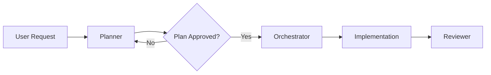

<Note>
  **Agent Type:** Read-Only Task Planner
  
  **Tools:** Read, Glob, Grep
</Note>

## Overview

The Planner agent performs read-only exploration of the codebase to break down complex tasks into structured implementation plans. It identifies all files that need changes, lists dependencies, estimates complexity, and presents a plan for approval before any implementation begins.

## When to Use

Use the Planner agent when:

<CardGroup cols={2}>
  <Card title="Multi-File Changes" icon="files">
    Task touches more than 5 files
  </Card>
  
  <Card title="Architecture Decisions" icon="sitemap">
    Requires architectural changes or design choices
  </Card>
  
  <Card title="Unclear Requirements" icon="question-circle">
    Requirements are ambiguous or need clarification
  </Card>
  
  <Card title="Complex Work" icon="diagram-nested">
    Expecting more than 10 tool calls during implementation
  </Card>
</CardGroup>

## Configuration

```yaml
---
name: planner
description: Break down complex tasks into implementation plans before writing code. Use when task touches >5 files, requires architecture decisions, or has unclear requirements.
tools: ["Read", "Glob", "Grep"]
---
```

### Available Tools

<ParamField path="Read" type="tool">
  Read files to understand current implementation
</ParamField>

<ParamField path="Glob" type="tool">
  Find files matching patterns
</ParamField>

<ParamField path="Grep" type="tool">
  Search for code patterns and references
</ParamField>

<Warning>
  The Planner agent is **read-only**. It cannot make changes to the codebase. Use it for exploration and planning only.
</Warning>

## Workflow

The Planner follows a systematic 6-step workflow:

<Steps>
  <Step title="Understand the Goal">
    Parse the task description and clarify the objective
  </Step>
  
  <Step title="Explore Relevant Code">
    Use read-only tools to explore the codebase and understand current implementation
  </Step>
  
  <Step title="Identify Files to Change">
    List all files that need modifications, additions, or deletions
  </Step>
  
  <Step title="List Dependencies and Ordering">
    Determine what depends on what and the order of changes
  </Step>
  
  <Step title="Estimate Complexity">
    Assess the size and risk level of the task
  </Step>
  
  <Step title="Present Plan for Approval">
    Output a structured plan and wait for user approval before proceeding
  </Step>
</Steps>

## Output Format

The Planner outputs a structured plan in the following format:

```markdown
## Plan: [Task Name]

### Goal
[One sentence describing what will be accomplished]

### Files to Modify
1. path/to/file.ts - [what changes will be made]
2. path/to/another.ts - [what changes will be made]

### Approach
[Step by step implementation approach]
1. First, do X because...
2. Then, update Y to...
3. Finally, add Z for...

### Risks
- [Potential issues or breaking changes]
- [Performance considerations]
- [Backward compatibility concerns]

### Questions
- [Clarifications needed from the user]
- [Technical decisions that need input]
```

## Example Usage

<CodeGroup>
```bash Example 1: API Refactoring
Task: Refactor the authentication API to use JWT tokens

Output:
## Plan: Refactor Authentication to JWT

### Goal
Replace session-based auth with JWT tokens for better scalability

### Files to Modify
1. src/auth/middleware.ts - Replace session checks with JWT validation
2. src/auth/login.ts - Generate JWT instead of creating session
3. src/auth/types.ts - Add JWT payload interface
4. src/config/auth.ts - Add JWT secret and expiry config
5. tests/auth/*.test.ts - Update all auth tests

### Approach
1. Add JWT config (secret, expiry) to auth config
2. Update login endpoint to generate JWT on success
3. Replace session middleware with JWT validation
4. Update types to reflect new auth flow
5. Update tests to use JWT instead of sessions

### Risks
- Breaking change - all clients need updates
- Need migration strategy for existing sessions
- JWT secret management critical for security

### Questions
- Should we support both methods during migration?
- What's the token expiry time?
- Do we need refresh tokens?
```

```bash Example 2: Feature Addition
Task: Add file upload capability to the editor

 Output:
## Plan: Add File Upload to Editor

### Goal
Allow users to upload images and documents directly in the editor

### Files to Modify
1. src/components/Editor.tsx - Add upload button and drop zone
2. src/hooks/useFileUpload.ts - New hook for upload logic
3. src/api/upload.ts - New API endpoint for file uploads
4. src/types/file.ts - File metadata types
5. server/routes/upload.ts - Server-side upload handler
6. server/storage/s3.ts - S3 integration for file storage

### Approach
1. Create useFileUpload hook with drag-drop and click support
2. Add upload API endpoint with multipart form handling
3. Integrate S3 for file storage
4. Update Editor component with upload UI
5. Add file metadata types and validation
6. Add progress indicators and error handling

### Risks
- Large files could cause performance issues
- Need file type validation for security
- Storage costs if many large files uploaded
- Need max file size limits

### Questions
- What file types should be allowed?
- Max file size limit?
- S3 bucket configuration available?
- Should files be public or private?
```
</CodeGroup>

## Rules and Constraints

The Planner adheres to strict rules:

<AccordionGroup>
  <Accordion title="Never Make Changes" icon="ban">
    The Planner performs **read-only exploration only**. It never modifies, creates, or deletes files.
  </Accordion>
  
  <Accordion title="Never Skip Approval" icon="clipboard-check">
    The Planner always presents the plan and waits for explicit approval before any implementation begins.
  </Accordion>
  
  <Accordion title="Never Assume Requirements" icon="question">
    When requirements are unclear, the Planner asks questions rather than making assumptions.
  </Accordion>
</AccordionGroup>

## Best Practices

<CardGroup cols={2}>
  <Card title="Be Specific" icon="bullseye">
    Provide detailed task descriptions. Include context about why the change is needed.
  </Card>
  
  <Card title="Review Thoroughly" icon="magnifying-glass">
    Review the plan carefully before approving. Check files list and approach.
  </Card>
  
  <Card title="Answer Questions" icon="messages">
    Address all questions in the Questions section before implementation starts.
  </Card>
  
  <Card title="Refine as Needed" icon="arrows-rotate">
    Don't hesitate to ask the Planner to revise if something seems off.
  </Card>
</CardGroup>

## Integration with Other Agents

The Planner works well with other agents:



<Tip>
  Use Planner for initial exploration, then hand off to Orchestrator for multi-phase implementation, and finally Reviewer for quality checks.
</Tip>

## Common Scenarios

### Scenario 1: New Feature

```bash
User: Add user profile page with avatar upload
Planner: Explores codebase, identifies routing, components, API endpoints
Output: Detailed plan with 8 files to modify, step-by-step approach
User: Approves plan
Next: Hand off to Orchestrator or implement directly
```

### Scenario 2: Refactoring

```bash
User: Refactor database queries to use TypeORM
Planner: Finds all query files, checks dependencies
Output: Plan with 15 files, migration strategy, risks
User: Asks about backward compatibility
Planner: Revises plan with compatibility layer
User: Approves
```

### Scenario 3: Unclear Requirements

```bash
User: Make the app faster
Planner: Explores performance bottlenecks
Output: Plan with 3 optimization areas, questions about priorities
User: Focus on API response time
Planner: Revises plan to target API optimizations only
```

## Limitations

<Warning>
  The Planner has these limitations:
  
  - **Read-only:** Cannot make any changes
  - **No execution:** Cannot run tests or verify hypotheses
  - **No write operations:** Cannot create example files or prototypes
</Warning>

For implementation and testing, use the Orchestrator or Debugger agents.

## Tips for Better Plans

<Steps>
  <Step title="Provide Context">
    Explain why the change is needed, not just what to change
  </Step>
  
  <Step title="Share Constraints">
    Mention any technical constraints, deadlines, or backward compatibility needs
  </Step>
  
  <Step title="Reference Examples">
    Point to similar features in the codebase that should be followed
  </Step>
  
  <Step title="Clarify Scope">
    Be clear about what's in scope and what's not
  </Step>
</Steps>

## Next Steps

<CardGroup cols={2}>
  <Card title="Orchestrator" icon="diagram-project" href="/agents/orchestrator">
    Multi-phase implementation after planning
  </Card>
  
  <Card title="Scout" icon="compass" href="/agents/scout">
    Confidence-gated exploration alternative
  </Card>
</CardGroup>