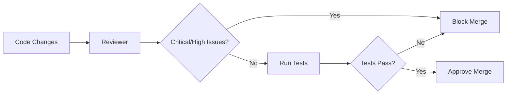

<Note>
  **Agent Type:** Code Review and Quality Assurance
  
  **Tools:** Read, Glob, Grep, Bash
</Note>

## Overview

The Reviewer agent is a code review specialist that performs comprehensive quality checks on code changes. It examines logic correctness, edge cases, error handling, security vulnerabilities, performance issues, and test coverage before changes are committed or merged.

## When to Use

Use the Reviewer agent:

<CardGroup cols={2}>
  <Card title="Before Committing" icon="git-alt">
    Review changes before creating commits
  </Card>
  
  <Card title="Pull Request Reviews" icon="code-pull-request">
    Comprehensive PR review before merging
  </Card>
  
  <Card title="Security Audits" icon="shield-halved">
    Check for security vulnerabilities and injection risks
  </Card>
  
  <Card title="After Major Changes" icon="code-compare">
    Quality check after significant refactoring or features
  </Card>
</CardGroup>

## Configuration

```yaml
---
name: reviewer
description: Code review specialist that checks for logic errors, security issues, and quality problems. Use before committing, for PR reviews, or after major changes.
tools: ["Read", "Glob", "Grep", "Bash"]
---
```

### Available Tools

<ParamField path="Read" type="tool">
  Read files to examine code changes
</ParamField>

<ParamField path="Glob" type="tool">
  Find related files that may be affected
</ParamField>

<ParamField path="Grep" type="tool">
  Search for patterns, potential issues, or similar code
</ParamField>

<ParamField path="Bash" type="tool">
  Run linters, tests, and other quality tools
</ParamField>

## Review Checklist

The Reviewer examines code across 6 critical dimensions:

<AccordionGroup>
  <Accordion title="1. Logic Correctness" icon="brain">
    **Does it do what's intended?**
    
    - Algorithm correctness
    - Business logic accuracy
    - Control flow validation
    - Return value correctness
    - Conditional logic completeness
  </Accordion>
  
  <Accordion title="2. Edge Cases" icon="triangle-exclamation">
    **Null, empty, bounds?**
    
    - Null/undefined handling
    - Empty array/string/object checks
    - Array bounds checking
    - Off-by-one errors
    - Overflow/underflow conditions
    - Unicode and special character handling
  </Accordion>
  
  <Accordion title="3. Error Handling" icon="exclamation-circle">
    **Proper handling?**
    
    - Try-catch blocks where needed
    - Error messages are helpful
    - Errors propagate correctly
    - No swallowed errors
    - Graceful degradation
    - User-facing error messages are clear
  </Accordion>
  
  <Accordion title="4. Security" icon="lock">
    **Injection, auth, secrets?**
    
    - SQL injection prevention
    - XSS protection
    - CSRF token validation
    - Authentication checks
    - Authorization verification
    - No hardcoded secrets
    - Input sanitization
    - Output encoding
  </Accordion>
  
  <Accordion title="5. Performance" icon="gauge-high">
    **O(n²) loops, memory?**
    
    - Time complexity reasonable
    - No nested loops on large data
    - Database query efficiency
    - Memory leaks prevented
    - Unnecessary re-renders avoided
    - Lazy loading where appropriate
    - Caching opportunities
  </Accordion>
  
  <Accordion title="6. Test Coverage" icon="vial">
    **Coverage adequate?**
    
    - Tests exist for new code
    - Edge cases are tested
    - Error paths are tested
    - Integration tests if needed
    - Test clarity and maintainability
  </Accordion>
</AccordionGroup>

## Output Format

The Reviewer provides feedback organized by severity:

```markdown
## Review: [Files/PR]

### Critical
- [Must fix before merge]
- file.ts:42 - SQL injection vulnerability in query construction
- auth.ts:15 - Missing authentication check on admin endpoint

### High
- [Should fix]
- utils.ts:89 - Potential null pointer dereference
- api.ts:120 - No error handling for network failures

### Medium
- [Nice to fix]
- component.tsx:55 - Unnecessary re-render on every keystroke
- helpers.ts:200 - Could simplify with Array.find()

### Low
- [Suggestions]
- styles.css:10 - Consider using CSS variables for colors
- README.md:5 - Typo in documentation

### Approved?
[Yes/No with conditions]
Yes, pending Critical and High issues are fixed.
```

## Severity Levels

<CardGroup cols={2}>
  <Card title="Critical" icon="circle-exclamation" color="#ef4444">
    **Must fix before merge**
    
    Security vulnerabilities, data corruption risks, production-breaking bugs
  </Card>
  
  <Card title="High" icon="triangle-exclamation" color="#f97316">
    **Should fix**
    
    Logic errors, missing error handling, significant performance issues
  </Card>
  
  <Card title="Medium" icon="circle-info" color="#eab308">
    **Nice to fix**
    
    Code quality, minor performance improvements, refactoring opportunities
  </Card>
  
  <Card title="Low" icon="lightbulb" color="#22c55e">
    **Suggestions**
    
    Style improvements, documentation, best practices
  </Card>
</CardGroup>

## Example Reviews

<CodeGroup>
```typescript Example 1: API Endpoint
// Code being reviewed:
app.post('/api/user', async (req, res) => {
  const { name, email } = req.body;
  const result = await db.query(
    `INSERT INTO users (name, email) VALUES ('${name}', '${email}')`
  );
  res.json(result);
});

// Reviewer output:
## Review: API Endpoint

### Critical
- api.ts:4 - SQL injection vulnerability. User input directly interpolated into query.
  FIX: Use parameterized queries: `db.query('INSERT INTO users (name, email) VALUES (?, ?)', [name, email])`

### High
- api.ts:2 - No input validation. Email could be invalid.
  FIX: Validate email format before inserting
- api.ts:1 - Missing authentication. Anyone can create users.
  FIX: Add auth middleware
- api.ts:7 - No error handling for database failures
  FIX: Wrap in try-catch

### Medium
- api.ts:7 - Exposes internal database result to client
  FIX: Return only necessary fields: `res.json({ id: result.id, name, email })`

### Approved?
No - Critical and High issues must be fixed.
```

```typescript Example 2: React Component
// Code being reviewed:
function UserList() {
  const [users, setUsers] = useState([]);
  
  useEffect(() => {
    fetch('/api/users')
      .then(r => r.json())
      .then(setUsers);
  }, []);
  
  return (
    <div>
      {users.map(user => (
        <div>{user.name}</div>
      ))}
    </div>
  );
}

// Reviewer output:
## Review: UserList Component

### High
- UserList.tsx:5 - No error handling for fetch failures
  FIX: Add .catch() handler
- UserList.tsx:13 - Missing key prop in map
  FIX: Add key={user.id}

### Medium
- UserList.tsx:5 - No loading state
  FIX: Add loading indicator while fetching
- UserList.tsx:5 - Fetch not cancelled on unmount
  FIX: Use AbortController

### Low
- UserList.tsx:13 - XSS risk if user.name contains HTML
  NOTE: React escapes by default, but be aware

### Approved?
Yes, after High issues fixed.
```
</CodeGroup>

## Rules and Constraints

<Warning>
  The Reviewer follows strict rules:
</Warning>

<AccordionGroup>
  <Accordion title="Never Auto-Approve" icon="ban">
    The Reviewer never automatically approves code without performing a thorough review.
  </Accordion>
  
  <Accordion title="Never Skip Security" icon="shield">
    Security checks are mandatory. The Reviewer always examines code for vulnerabilities.
  </Accordion>
  
  <Accordion title="Suggest Fixes" icon="wrench">
    The Reviewer doesn't just flag problems—it suggests specific fixes and improvements.
  </Accordion>
</AccordionGroup>

## Best Practices

<Steps>
  <Step title="Review Early">
    Run Reviewer before committing, not just before merging. Catch issues early.
  </Step>
  
  <Step title="Address Critical First">
    Fix Critical issues immediately. They represent security risks or production bugs.
  </Step>
  
  <Step title="Consider Context">
    Some "issues" may be intentional. Use judgment when applying suggestions.
  </Step>
  
  <Step title="Automate Quality Gates">
    Integrate Reviewer into CI/CD pipelines for consistent quality checks.
  </Step>
</Steps>

## Common Issues Detected

### Security Vulnerabilities

<CodeGroup>
```typescript SQL Injection
// BAD
db.query(`SELECT * FROM users WHERE id = ${userId}`);

// GOOD
db.query('SELECT * FROM users WHERE id = ?', [userId]);
```

```typescript XSS Prevention
// BAD
div.innerHTML = userInput;

// GOOD
div.textContent = userInput;
// or use framework escaping (React, Vue, etc.)
```

```typescript Hardcoded Secrets
// BAD
const API_KEY = 'sk_live_123abc';

// GOOD
const API_KEY = process.env.API_KEY;
```
</CodeGroup>

### Logic Errors

<CodeGroup>
```typescript Null Handling
// BAD
function getFirstName(user) {
  return user.name.split(' ')[0];
}

// GOOD
function getFirstName(user) {
  return user?.name?.split(' ')[0] || 'Unknown';
}
```

```typescript Array Bounds
// BAD
const lastItem = array[array.length];

// GOOD
const lastItem = array[array.length - 1];
// or
const lastItem = array.at(-1);
```
</CodeGroup>

### Performance Issues

<CodeGroup>
```typescript N+1 Query
// BAD
for (const user of users) {
  user.posts = await db.query('SELECT * FROM posts WHERE userId = ?', [user.id]);
}

// GOOD
const userIds = users.map(u => u.id);
const posts = await db.query('SELECT * FROM posts WHERE userId IN (?)', [userIds]);
// then group by userId
```

```typescript Unnecessary Re-renders
// BAD
function Component() {
  return (
    <Child onChange={(e) => handleChange(e)} />
  );
}

// GOOD
function Component() {
  const handleChange = useCallback((e) => {
    // handler
  }, []);
  
  return <Child onChange={handleChange} />;
}
```
</CodeGroup>

## Integration with CI/CD

Integrate Reviewer into your development workflow:



<Tip>
  Set up pre-commit hooks to run Reviewer automatically before each commit.
</Tip>

## Comparison with Other Agents

| Feature | Reviewer | Planner | Debugger |
|---------|----------|---------|----------|
| **Purpose** | Quality checks | Task planning | Bug fixing |
| **Timing** | Before commit | Before implementation | When bugs occur |
| **Makes changes** | No | No | Yes (with approval) |
| **Focus** | Code quality | Architecture | Root cause |

## Next Steps

<CardGroup cols={2}>
  <Card title="Debugger" icon="bug" href="/agents/debugger">
    Systematic debugging for issues found by Reviewer
  </Card>
  
  <Card title="Orchestrator" icon="diagram-project" href="/agents/orchestrator">
    Multi-phase development with built-in quality gates
  </Card>
</CardGroup>