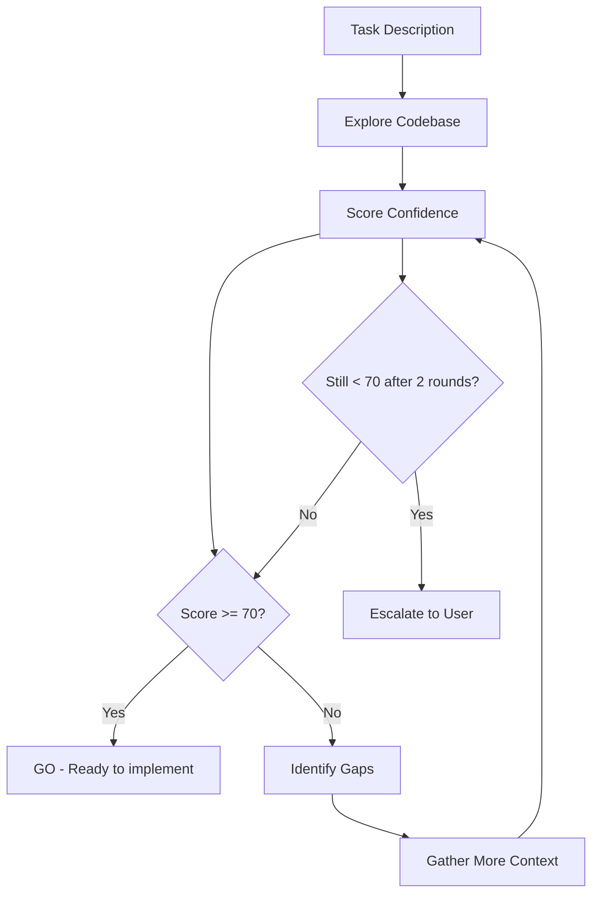
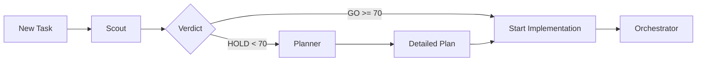

<Note>
  **Agent Type:** Background Confidence Assessment
  
  **Tools:** Read, Glob, Grep, Bash
  
  **Special:** Runs in background with isolated worktree
</Note>

## Overview

The Scout agent performs confidence-gated exploration to assess whether you have enough context to implement a task successfully. It scores readiness 0-100 across five dimensions and delivers a GO/HOLD verdict. Scout runs in the background, allowing you to continue working while it explores.

## When to Use

Use Scout before starting implementation of:

<CardGroup cols={2}>
  <Card title="Unfamiliar Code" icon="map">
    Working in parts of the codebase you haven't touched before
  </Card>
  
  <Card title="Complex Tasks" icon="diagram-nested">
    Tasks with unclear scope or many unknowns
  </Card>
  
  <Card title="High Risk Changes" icon="triangle-exclamation">
    Changes that could break existing functionality
  </Card>
  
  <Card title="New Features" icon="sparkles">
    Building features without clear patterns to follow
  </Card>
</CardGroup>

## Configuration

```yaml
---
name: scout
description: Confidence-gated exploration that assesses readiness before implementation. Scores 0-100 across five dimensions and gives GO/HOLD verdict.
tools: ["Read", "Glob", "Grep", "Bash"]
background: true
isolation: worktree
---
```

### Special Capabilities

<ParamField path="background" type="boolean" default={true}>
  Scout runs in the background, allowing you to continue working while it explores the codebase.
</ParamField>

<ParamField path="isolation" type="string" default="worktree">
  Scout runs in an isolated worktree to avoid interfering with your main work session.
</ParamField>

<Warning>
  Scout is **read-only**. It never edits files or makes changes.
</Warning>

## Workflow

Scout follows a confidence-building workflow:

<Steps>
  <Step title="Receive Task">
    Get the task description from you
  </Step>
  
  <Step title="Explore Codebase">
    Search for relevant files, patterns, and dependencies
  </Step>
  
  <Step title="Score Confidence">
    Rate readiness 0-100 across five dimensions
  </Step>
  
  <Step title="Verdict">
    If score >= 70: **GO** with findings
    
    If score < 70: Identify gaps, gather more context, re-score
  </Step>
</Steps>



## Confidence Scoring

Scout evaluates five dimensions, each worth 0-20 points:

### 1. Scope Clarity (0-20)

<AccordionGroup>
  <Accordion title="20 points: Crystal Clear" icon="check">
    - Know exactly which files need changes
    - Understand all modifications required
    - Can enumerate every change needed
  </Accordion>
  
  <Accordion title="10-15 points: Mostly Clear" icon="circle-half-stroke">
    - Know most files that need changes
    - Some uncertainty about edge cases
    - Can estimate change scope
  </Accordion>
  
  <Accordion title="0-5 points: Unclear" icon="circle-question">
    - Unsure which files to modify
    - Don't understand the full scope
    - Many unknowns remain
  </Accordion>
</AccordionGroup>

### 2. Pattern Familiarity (0-20)

<AccordionGroup>
  <Accordion title="20 points: Clear Patterns" icon="copy">
    - Codebase has similar features to follow
    - Patterns are consistent and documented
    - Can copy existing approach
  </Accordion>
  
  <Accordion title="10-15 points: Some Patterns" icon="clone">
    - Found some related code
    - Patterns exist but inconsistent
    - Need to adapt existing patterns
  </Accordion>
  
  <Accordion title="0-5 points: No Patterns" icon="question">
    - No similar features exist
    - First time implementing this type of feature
    - Need to create new patterns
  </Accordion>
</AccordionGroup>

### 3. Dependency Awareness (0-20)

<AccordionGroup>
  <Accordion title="20 points: Full Awareness" icon="sitemap">
    - Know all dependencies and dependents
    - Understand impact of changes
    - Can predict breaking changes
  </Accordion>
  
  <Accordion title="10-15 points: Partial Awareness" icon="diagram-project">
    - Know major dependencies
    - Some unknowns about impact
    - Can identify most breaking changes
  </Accordion>
  
  <Accordion title="0-5 points: Unknown" icon="circle-nodes">
    - Don't know what depends on this code
    - Can't predict impact
    - High risk of breaking things
  </Accordion>
</AccordionGroup>

### 4. Edge Case Coverage (0-20)

<AccordionGroup>
  <Accordion title="20 points: Comprehensive" icon="shield-check">
    - Can enumerate all edge cases
    - Know how to handle errors
    - Understand validation requirements
  </Accordion>
  
  <Accordion title="10-15 points: Adequate" icon="shield">
    - Know major edge cases
    - Some uncertainty about errors
    - Basic validation understood
  </Accordion>
  
  <Accordion title="0-5 points: Gaps" icon="shield-xmark">
    - Don't know edge cases
    - Unsure how to handle errors
    - Validation requirements unclear
  </Accordion>
</AccordionGroup>

### 5. Test Strategy (0-20)

<AccordionGroup>
  <Accordion title="20 points: Clear Strategy" icon="vial">
    - Know exactly how to test changes
    - Test patterns exist to follow
    - Can verify all functionality
  </Accordion>
  
  <Accordion title="10-15 points: Basic Strategy" icon="flask">
    - Have general testing approach
    - Some test patterns available
    - Can verify main functionality
  </Accordion>
  
  <Accordion title="0-5 points: No Strategy" icon="flask-vial">
    - Don't know how to test
    - No test patterns to follow
    - Unclear how to verify changes
  </Accordion>
</AccordionGroup>

## Output Format

```text
SCOUT REPORT
Task: Add user profile page with avatar upload
Confidence: 85/100

Dimensions:
  Scope clarity:        18/20  ✓
  Pattern familiarity:  17/20  ✓
  Dependency awareness: 16/20  ✓
  Edge case coverage:   17/20  ✓
  Test strategy:        17/20  ✓

VERDICT: GO

Findings:
- User pages follow pattern in src/pages/user/*.tsx
- Avatar upload similar to src/components/ImageUpload.tsx
- Profile API endpoints exist: GET/PUT /api/user/:id/profile
- Tests follow pattern in tests/pages/*.test.tsx
- Need to handle: missing avatar, invalid image types, file size limits

Ready to implement. Follow ImageUpload pattern for avatar handling.
```

## Example Scenarios

<CodeGroup>
```text Example 1: High Confidence (GO)
Task: Add dark mode toggle to settings

SCOUT REPORT
Confidence: 92/100

Dimensions:
  Scope clarity:        19/20  ✓
  Pattern familiarity:  20/20  ✓
  Dependency awareness: 18/20  ✓
  Edge case coverage:   18/20  ✓
  Test strategy:        17/20  ✓

VERDICT: GO

Findings:
- Theme system exists in src/theme/
- Settings page at src/pages/Settings.tsx
- Dark mode CSS variables defined
- Toggle component in src/components/Toggle.tsx
- Tests in tests/theme/*.test.tsx

Files to change:
1. src/pages/Settings.tsx - Add toggle
2. src/hooks/useTheme.ts - Add dark mode state
3. tests/pages/Settings.test.tsx - Add tests

Ready to implement.
```

```text Example 2: Low Confidence (HOLD)
Task: Implement real-time collaboration

SCOUT REPORT
Confidence: 45/100

Dimensions:
  Scope clarity:         8/20  ✗
  Pattern familiarity:   5/20  ✗
  Dependency awareness: 12/20  ~
  Edge case coverage:    10/20  ~
  Test strategy:         10/20  ~

VERDICT: HOLD

Gaps identified:
- No existing WebSocket infrastructure
- No real-time patterns in codebase
- Unclear how to handle conflicts
- Unknown: which data should be real-time?
- Unknown: how many concurrent users?

Gathering more context...

[After exploration]
Confidence: 48/100 (still < 70)

Recommendation:
- Need architecture decision on WebSocket vs SSE
- Need conflict resolution strategy
- Suggest using Planner agent for full design

Escalating to user for guidance.
```

```text Example 3: Improving Score
Task: Add email notifications

Round 1 - Confidence: 62/100 - HOLD
  Scope clarity:        15/20
  Pattern familiarity:   8/20  ✗
  Dependency awareness: 14/20
  Edge case coverage:   12/20
  Test strategy:        13/20

Gap: No email notification patterns found

[Exploring further...]
- Found email service in src/services/email/
- Found notification queue in src/queues/notification.ts
- Templates exist in templates/email/

Round 2 - Confidence: 78/100 - GO
  Scope clarity:        17/20  ✓
  Pattern familiarity:  16/20  ✓
  Dependency awareness: 14/20  ✓
  Edge case coverage:   15/20  ✓
  Test strategy:        16/20  ✓

VERDICT: GO

Ready to implement following email service patterns.
```
</CodeGroup>

## Rules and Constraints

<Warning>
  Scout adheres to strict rules:
</Warning>

<AccordionGroup>
  <Accordion title="Never Edit Files" icon="ban">
    Scout performs **read-only exploration only**. It never modifies the codebase.
  </Accordion>
  
  <Accordion title="Be Honest About Gaps" icon="heart">
    A false GO wastes more time than a HOLD. Scout is brutally honest about confidence.
  </Accordion>
  
  <Accordion title="Re-Score After Context" icon="arrows-rotate">
    If score < 70, Scout gathers more context and re-scores. Maximum 2 rounds before escalating.
  </Accordion>
  
  <Accordion title="Isolated Execution" icon="code-branch">
    Runs in isolated worktree to avoid interfering with your main work session.
  </Accordion>
</AccordionGroup>

## Best Practices

<Steps>
  <Step title="Use Early">
    Run Scout before starting implementation, not when you're already stuck
  </Step>
  
  <Step title="Trust the Verdict">
    If Scout says HOLD, gather more context before proceeding
  </Step>
  
  <Step title="Continue Working">
    Scout runs in background—keep working on other tasks while it explores
  </Step>
  
  <Step title="Review Findings">
    Even with GO verdict, review Scout's findings to inform your approach
  </Step>
</Steps>

## Comparison with Planner

| Feature | Scout | Planner |
|---------|-------|----------|
| **Output** | GO/HOLD verdict | Detailed plan |
| **Scoring** | 0-100 confidence | Not applicable |
| **Execution** | Background | Foreground |
| **Isolation** | Worktree | None |
| **Re-attempts** | Auto (max 2) | Manual |
| **Use case** | Quick confidence check | Detailed planning |

<Tip>
  Use Scout for quick checks and Planner for detailed architectural planning.
</Tip>

## Integration Example



## Troubleshooting

<AccordionGroup>
  <Accordion title="Scout Takes Too Long" icon="clock">
    Scout runs in background and should not block your work. If it seems slow, check:
    - Very large codebase? May need more time
    - Complex dependencies? Requires thorough exploration
    - Wait for verdict or continue with other tasks
  </Accordion>
  
  <Accordion title="Always Getting HOLD" icon="hand">
    If Scout consistently returns HOLD:
    - Task might be too complex for immediate implementation
    - Codebase might lack patterns for this feature
    - Consider breaking task into smaller pieces
    - Use Planner for architectural guidance
  </Accordion>
  
  <Accordion title="GO But Still Confused" icon="circle-question">
    If Scout says GO but you're uncertain:
    - Review the findings section carefully
    - Score may be borderline (70-75)
    - Run Planner for more detailed guidance
    - Trust your judgment—human intuition matters
  </Accordion>
</AccordionGroup>

## Next Steps

<CardGroup cols={2}>
  <Card title="Orchestrator" icon="diagram-project" href="/agents/orchestrator">
    Multi-phase implementation after GO verdict
  </Card>
  
  <Card title="Planner" icon="map" href="/agents/planner">
    Detailed planning for HOLD scenarios
  </Card>
</CardGroup>