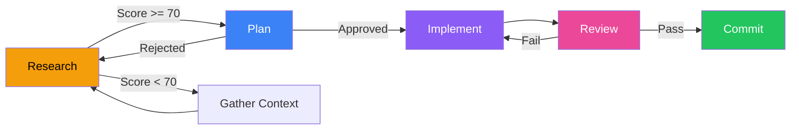

Multi-phase development is a structured approach to building features that touch multiple files or require architectural decisions. It breaks work into validated phases to reduce correction cycles.

## The Problem

Without structure, complex features often fail:
- Jumping into implementation without understanding the codebase
- Missing edge cases or dependencies
- Discovering plan was wrong after 20 edits
- No clear stopping points for review

**Result:** High correction rate, wasted context, frequent backtracking.

## The Solution: RPI Workflow

**Research > Plan > Implement** with validation gates between each phase.



## Phase 1: Research

**Goal:** Assess feasibility and gather context before planning.

### Activities

<Steps>
  <Step title="Find relevant files">
    Use Glob and Grep to locate all files related to the feature
  </Step>
  <Step title="Study existing patterns">
    Read similar features to understand conventions
  </Step>
  <Step title="Check dependencies">
    Identify what depends on the code you'll change
  </Step>
  <Step title="Identify edge cases">
    List non-obvious scenarios that must be handled
  </Step>
  <Step title="Score confidence">
    Rate your understanding across 5 dimensions (0-100)
  </Step>
</Steps>

### Confidence Scoring

Score each dimension 0-20 points:

| Dimension | Question | 0 Points | 20 Points |
|-----------|----------|----------|----------|
| **Scope Clarity** | Know exactly what files change? | No idea | Complete list |
| **Pattern Familiarity** | Similar patterns exist? | Never seen | Multiple examples |
| **Dependency Awareness** | Know what depends on this? | Unknown | Fully mapped |
| **Edge Cases** | Can identify edge cases? | Uncertain | Comprehensive list |
| **Test Strategy** | Know how to verify? | Unclear | Clear test plan |

**Total Score:**
- **70-100**: GO to planning
- **50-69**: Gather more context, re-score
- **0-49**: Ask user for more information

<Warning>
  Don't skip to planning with a score below 70. The plan will be incomplete.
</Warning>

### Research Output

```text
RESEARCH FINDINGS: Add Webhook Support

Relevant Files:
- src/api/events.ts - Event emission patterns
- src/models/webhook.ts - Existing (but unused) webhook model
- src/services/delivery.ts - HTTP delivery service
- tests/webhooks.spec.ts - Test setup exists

Existing Patterns:
- Event emission: EventEmitter pattern throughout codebase
- Retry logic: Exponential backoff in delivery.ts
- Auth: HMAC signatures for external calls

Dependencies:
- events.ts is imported by 12 files
- webhook.ts has no imports (safe to modify)

Edge Cases:
- Webhook endpoint down (needs retry + DLQ)
- Circular webhooks (webhook triggers webhook)
- High-volume events (rate limiting needed)

Test Strategy:
- Mock HTTP calls in unit tests
- Integration test with local server
- Load test for high-volume scenarios

Confidence Score:
- Scope clarity: 18/20 (one area unclear: how to handle failures)
- Pattern familiarity: 20/20 (clear examples exist)
- Dependency awareness: 16/20 (events.ts has many dependents)
- Edge cases: 14/20 (may be missing some)
- Test strategy: 18/20 (clear path)
Total: 86/100 → GO TO PLAN
```

## Phase 2: Plan

**Goal:** Design the solution and get approval before writing code.

### Plan Template

```text
PLAN: [Feature Name]

Goal: [One sentence description]

Files to modify:
1. path/file.ts - [what changes, why]
2. path/other.ts - [what changes, why]

New files:
1. path/new-file.ts - [purpose]

Approach:
1. [Step with rationale]
2. [Step with rationale]
3. [Step with rationale]

Risks:
- [Potential issue and mitigation]
- [Potential issue and mitigation]

Test strategy:
- [How to verify each change]

Estimated scope: [S/M/L]
```

### Real Example

<Accordion title="Example: Webhook Support Plan">
```text
PLAN: Add Webhook Support

Goal: Allow users to register webhooks that trigger on specific events

Files to modify:
1. src/models/webhook.ts - Activate existing model, add validation
2. src/api/events.ts - Add webhook delivery on event emission
3. src/services/delivery.ts - Add retry logic and DLQ
4. src/api/routes/webhooks.ts - New CRUD endpoints for webhook management

New files:
1. src/queue/webhook-queue.ts - Background job processor for retries
2. migrations/add-webhook-tables.sql - Database schema

Approach:
1. Activate webhook model with validation (URL format, event types)
2. Add database migration for webhook storage
3. Create CRUD API endpoints (create, list, delete webhooks)
4. Hook into existing event emission to trigger webhooks
5. Implement delivery service with exponential backoff (1s, 2s, 4s, 8s, 16s)
6. Add DLQ for failed deliveries after 5 retries
7. Add HMAC signature for security

Risks:
- High-volume events could overwhelm queue
  → Mitigation: Rate limit per webhook (100/min), circuit breaker
- Circular webhooks (A triggers B, B triggers A)
  → Mitigation: Track event chain depth, max depth = 3
- Webhook endpoint down for extended period
  → Mitigation: DLQ + admin UI to replay failed events

Test strategy:
- Unit tests: webhook validation, HMAC generation
- Integration tests: mock HTTP server, verify retries
- Load tests: 1000 events/sec, verify queue doesn't back up
- Security test: verify HMAC signature rejection on tamper

Estimated scope: M (3-4 hours)
```
</Accordion>

### Approval Gate

**Wait for explicit approval:**
- "proceed"
- "approved"
- "go ahead"
- "looks good"

**If rejected:**
- Ask clarifying questions
- Revise the plan
- Present revised plan
- Wait for approval again

<Note>
  Never proceed to implementation without explicit approval. This is the most critical gate.
</Note>

## Phase 3: Implement

**Goal:** Execute the plan step by step with quality gates.

### Implementation Rules

<Steps>
  <Step title="Follow plan order">
    Make changes in the sequence specified in the plan
  </Step>
  <Step title="Test after each file">
    Run relevant tests after each file change
  </Step>
  <Step title="Review checkpoints">
    Pause for review every 5 edits
  </Step>
  <Step title="Quality gates">
    Run lint, typecheck, and full test suite at the end
  </Step>
  <Step title="Self-review">
    Check for common issues before presenting
  </Step>
</Steps>

### Review Checkpoints

Every 5 edits, pause and report:

```text
CHECKPOINT: 5 files edited

Completed:
✓ Activated webhook model with validation
✓ Added database migration
✓ Created CRUD endpoints
✓ Hooked into event emission
✓ Implemented delivery service

Tests: All passing (23/23)

Next:
- Add DLQ for failed deliveries
- Add HMAC signatures
- Load testing

Ready to continue? (or pause for review)
```

### Quality Gates

Before marking implementation complete:

<Tabs>
  <Tab title="Lint">
    ```bash
    npm run lint
    # or
    pnpm lint
    # or
    yarn lint
    ```
    
    Zero warnings and errors required.
  </Tab>
  
  <Tab title="Typecheck">
    ```bash
    npm run typecheck
    # or
    tsc --noEmit
    ```
    
    No type errors allowed.
  </Tab>
  
  <Tab title="Tests">
    ```bash
    npm test
    # or for changed files only
    npm test -- --changed
    ```
    
    All tests passing, coverage maintained or increased.
  </Tab>
  
  <Tab title="Self-Review">
    Check for:
    - console.log or debugger statements
    - TODO comments
    - Secrets or credentials
    - Unused imports
    - Missing error handling
  </Tab>
</Tabs>

### When Plan Is Wrong

If implementation reveals the plan was incorrect:

1. **Stop implementation**
2. **Document what you learned**
3. **Go back to Phase 2 (Plan)**
4. **Revise the plan**
5. **Get approval again**
6. **Resume implementation**

<Warning>
  Don't try to fix a bad plan by improvising during implementation. Go back to planning.
</Warning>

## Phase 4: Review & Commit

**Goal:** Final verification before committing.

### Review Checklist

<Accordion title="Security Review">
  - [ ] No hardcoded credentials or API keys
  - [ ] Input validation on all user data
  - [ ] SQL injection prevention (parameterized queries)
  - [ ] XSS prevention (sanitized output)
  - [ ] Authentication and authorization checks
  - [ ] HTTPS for external calls
</Accordion>

<Accordion title="Code Quality">
  - [ ] Follows existing code patterns
  - [ ] No copy-paste duplication
  - [ ] Clear variable and function names
  - [ ] Comments for non-obvious logic
  - [ ] Error messages are helpful
  - [ ] No debug statements (console.log, debugger)
</Accordion>

<Accordion title="Testing">
  - [ ] Unit tests for business logic
  - [ ] Integration tests for API endpoints
  - [ ] Edge cases covered
  - [ ] Error cases covered
  - [ ] Tests are maintainable (not brittle)
  - [ ] Coverage maintained or increased
</Accordion>

<Accordion title="Documentation">
  - [ ] README updated if needed
  - [ ] API documentation updated
  - [ ] Migration instructions if schema changed
  - [ ] CHANGELOG entry
</Accordion>

### Commit Message

Use conventional commit format:

```text
feat(webhooks): add webhook support with retry logic

- Activated webhook model with URL and event validation
- Created CRUD endpoints for webhook management  
- Integrated webhook delivery on event emission
- Implemented exponential backoff retry (5 attempts)
- Added DLQ for failed deliveries
- Added HMAC signature for security

Closes #123
```

## The /develop Command

Pro Workflow provides a `/develop` command that orchestrates all phases:

```bash
/develop "add webhook support"
```

### What It Does

<Steps>
  <Step title="Phase 1: Research">
    Orchestrator agent explores codebase and scores confidence
  </Step>
  <Step title="GO/NO-GO Decision">
    Proceeds if score >= 70, otherwise asks for more context
  </Step>
  <Step title="Phase 2: Plan">
    Presents detailed plan and waits for approval
  </Step>
  <Step title="Phase 3: Implement">
    Executes plan with checkpoints every 5 edits
  </Step>
  <Step title="Phase 4: Review">
    Runs quality gates and self-review
  </Step>
  <Step title="Learning Capture">
    Prompts for [LEARN] rules based on corrections
  </Step>
</Steps>

### Orchestrator Agent

The orchestrator agent drives the process:

```yaml
---
name: orchestrator
description: Multi-phase development agent. Use PROACTIVELY for >5 file features
tools: ["Read", "Glob", "Grep", "Bash", "Edit", "Write"]
skills: ["pro-workflow"]
model: opus
memory: project
---
```

**Key features:**
- Opus model for deep reasoning
- Project memory to recall patterns
- Pre-loaded with pro-workflow skill
- Full tool access for all phases

## When to Use Multi-Phase

| Scenario | Use Multi-Phase? |
|----------|------------------|
| Feature touches > 5 files | ✓ Yes |
| Architecture decision needed | ✓ Yes |
| Requirements unclear | ✓ Yes |
| Multiple approaches possible | ✓ Yes |
| Simple bug fix | ✗ No, just fix it |
| Single file change | ✗ No, too much overhead |
| Typo or formatting | ✗ No, directly edit |

## Best Practices

### Do

<Check>Score confidence honestly in research phase</Check>
<Check>Wait for explicit approval before implementing</Check>
<Check>Follow plan order during implementation</Check>
<Check>Run tests after each file change</Check>
<Check>Pause at review checkpoints (every 5 edits)</Check>
<Check>Go back to planning if plan is wrong</Check>
<Check>Capture learnings at the end</Check>

### Don't

<X>Skip research phase to save time</X>
<X>Proceed without approval (even if plan seems obvious)</X>
<X>Improvise during implementation</X>
<X>Batch all tests to the end</X>
<X>Skip quality gates to finish faster</X>
<X>Try to salvage a bad plan by improvising</X>

## Real-World Examples

<AccordionGroup>
  <Accordion title="Feature: User Authentication">
    **Research Phase:**
    - Found existing auth stubs in `src/auth/`
    - JWT pattern used in sister project
    - Database schema needs migration
    - Score: 78/100 → GO
    
    **Plan Phase:**
    - 8 files to modify
    - 3 new files (middleware, service, types)
    - Approach: JWT + refresh tokens
    - Risks: Token rotation, concurrent sessions
    - Approved by user
    
    **Implement Phase:**
    - Checkpoint 1: JWT generation (5 files)
    - Checkpoint 2: Refresh flow (5 files)
    - Checkpoint 3: Middleware (3 files)
    - All tests passing
    
    **Review Phase:**
    - Security: HTTPS required, tokens expire
    - Quality: Follows existing patterns
    - Tests: 95% coverage
    - Committed
  </Accordion>
  
  <Accordion title="Feature: GraphQL API">
    **Research Phase:**
    - No GraphQL in codebase
    - REST patterns well-established
    - Score: 45/100 → HOLD
    - Asked user: "Should this use GraphQL or extend REST API?"
    
    **User Clarification:**
    - "Extend REST for now, GraphQL later"
    
    **Re-Research:**
    - REST patterns clear
    - Versioning strategy exists
    - Score: 82/100 → GO
    
    (Continues with plan and implementation)
  </Accordion>
</AccordionGroup>

## Integration with Other Patterns

Multi-phase development works with:

**Self-Correction Loop**
- Capture corrections from each phase as [LEARN] rules
- Apply learnings in future research phases

**Parallel Worktrees**
- Run research in background worktree while continuing other work
- Don't block on planning

**80/20 Review**
- Review checkpoints align with 80/20 pattern
- Batch reviews at phase boundaries

**Agent Teams**
- Parallel research: multiple teammates explore different approaches
- Lead synthesizes findings into single plan

## Next Steps

<CardGroup cols={2}>
  <Card title="Orchestration Patterns" icon="diagram-project" href="/concepts/orchestration-patterns">
    Learn advanced orchestration techniques
  </Card>
  <Card title="Self-Correction Loop" icon="arrow-rotate-left" href="/concepts/self-correction-loop">
    Capture learnings from each phase
  </Card>
</CardGroup>