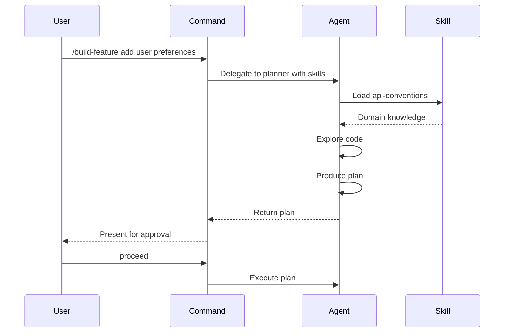
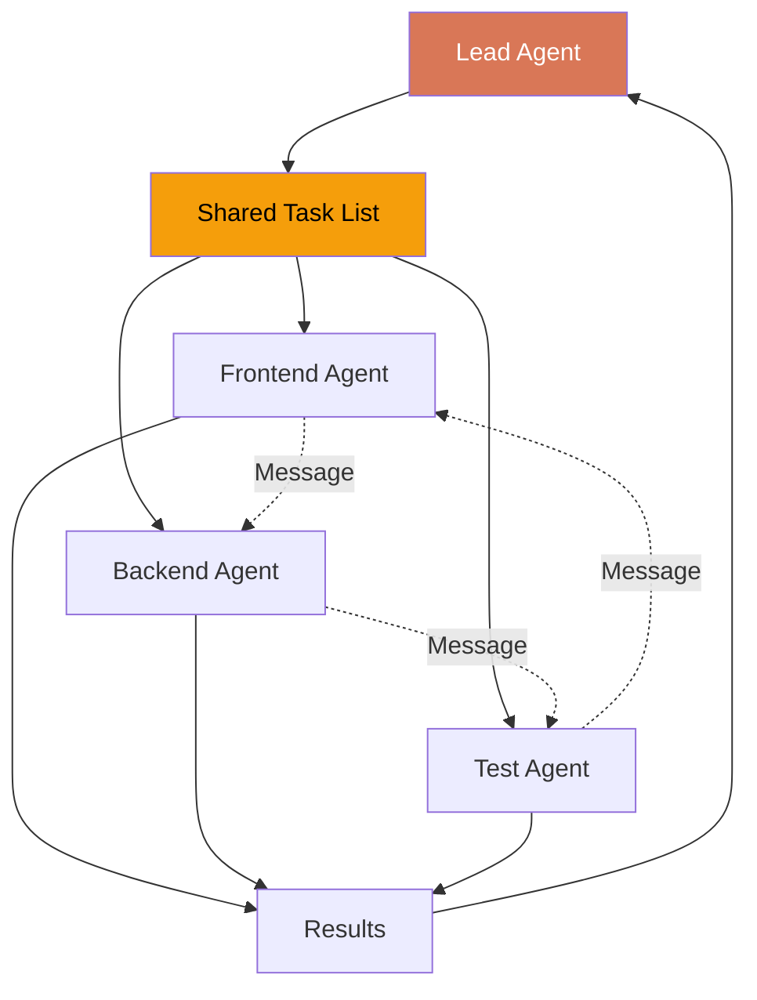

Orchestration patterns define how Commands, Agents, and Skills work together to handle complex development tasks. Each pattern solves specific coordination challenges.

## Pattern 1: Command > Agent > Skill

The most powerful pattern for complex features. Three layers with single responsibilities.

### Structure

```text
Command (entry point, user-facing)
  └── Agent (execution, constrained tools)
        └── Skill (domain knowledge, preloaded)
```

### Example: Feature Builder

<Tabs>
  <Tab title="Command">
    `commands/build-feature.md`
    
    ```markdown
    ---
    description: Build a feature end-to-end with planning, implementation, and tests
    argument-hint: &lt;feature description&gt;
    ---
    
    Build this feature using a structured approach:
    
    1. Delegate to the planner agent to create a plan
    2. Wait for plan approval
    3. Implement the plan
    4. Run quality gates
    5. Create a commit
    
    Feature: $ARGUMENTS
    ```
  </Tab>
  
  <Tab title="Agent">
    `agents/planner.md`
    
    ```yaml
    ---
    name: planner
    description: Break down tasks into plans
    tools: ["Read", "Glob", "Grep"]
    skills: ["api-conventions", "project-patterns"]
    model: opus
    ---
    ```
  </Tab>
  
  <Tab title="Skill">
    `skills/api-conventions/SKILL.md`
    
    ```yaml
    ---
    name: api-conventions
    description: API design patterns for this project
    user-invocable: false
    ---
    
    REST endpoints use camelCase. Auth via Bearer tokens.
    Error responses follow RFC 7807.
    ```
  </Tab>
</Tabs>

### Flow Diagram



### How It Flows

<Steps>
  <Step title="User runs command">
    `/build-feature add user preferences`
  </Step>
  <Step title="Command expands arguments">
    Substitutes `$ARGUMENTS` with "add user preferences"
  </Step>
  <Step title="Agent loads with skills">
    Planner starts with `api-conventions` and `project-patterns` in context
  </Step>
  <Step title="Agent explores">
    Uses constrained tools (Read, Glob, Grep) to understand codebase
  </Step>
  <Step title="Agent produces plan">
    Applies skill knowledge to design solution
  </Step>
  <Step title="Control returns">
    Command waits for user approval
  </Step>
  <Step title="Implementation proceeds">
    With full context and approved plan
  </Step>
</Steps>

## Pattern 2: Multi-Phase Development (RPI)

Research > Plan > Implement with validation gates between phases.

### Structure

```text
.claude/
├── commands/
│   └── develop.md          # Entry point
├── agents/
│   ├── researcher.md       # Phase 1: explore and validate
│   ├── architect.md        # Phase 2: design
│   └── implementer.md      # Phase 3: build
└── skills/
    └── project-patterns/
        └── SKILL.md         # Shared knowledge
```

### The Flow

```text
/develop "add webhook support"
    │
    ▼
[Research Phase] → researcher agent
    │  - Explore existing code
    │  - Find similar patterns
    │  - Check dependencies
    │  - Score confidence (0-100)
    │
    ├── Score &lt; 70 → HOLD (ask user for more context)
    │
    ▼
[Plan Phase] → architect agent
    │  - Design the solution
    │  - List all files to change
    │  - Identify risks
    │  - Present plan for approval
    │
    ├── User rejects → Back to research
    │
    ▼
[Implement Phase] → implementer agent
    │  - Execute the plan step by step
    │  - Run tests after each step
    │  - Quality gates at checkpoints
    │
    ▼
[Verify] → reviewer agent
    │  - Code review the changes
    │  - Security check
    │  - Performance check
    │
    ▼
[Commit] → /commit command
```

<Warning>
  Never skip phases. Research before planning, plan before implementing.
</Warning>

### Phase Agents

<Tabs>
  <Tab title="Researcher">
    ```yaml
    ---
    name: researcher
    description: Explore codebase to assess feasibility
    tools: ["Read", "Glob", "Grep", "Bash"]
    background: true
    isolation: worktree
    memory: project
    ---
    ```
    
    Runs in background with worktree isolation so it doesn't block the main session.
  </Tab>
  
  <Tab title="Architect">
    ```yaml
    ---
    name: architect
    description: Design implementation plans with risk assessment
    tools: ["Read", "Glob", "Grep"]
    skills: ["project-patterns"]
    model: opus
    ---
    ```
    
    Read-only tools, Opus model for deep reasoning, preloaded project patterns.
  </Tab>
  
  <Tab title="Implementer">
    ```yaml
    ---
    name: implementer
    description: Execute approved plans step by step
    tools: ["Read", "Edit", "Write", "Bash"]
    skills: ["quality-gates"]
    model: sonnet
    ---
    ```
    
    Full tool access, quality gates skill preloaded.
  </Tab>
</Tabs>

## Pattern 3: Agent Skills vs On-Demand Skills

Two ways to use skills—understand when to use each.

### Agent Skills (Preloaded)

```yaml
# In agent frontmatter
skills: ["api-conventions", "error-handling"]
```

**Characteristics:**
- Full skill content injected into agent context at startup
- Always available, no invocation needed
- Use for: domain knowledge the agent always needs
- Cost: uses context tokens

### On-Demand Skills (Invoked)

```yaml
# In skill frontmatter
user-invocable: true
context: fork  # Optional: isolated execution
```

**Characteristics:**
- User runs `/skill-name` or Claude invokes via `Skill()` tool
- Content loaded only when called
- Use for: procedures run occasionally
- `context: fork` runs in isolated subagent context

### Decision Matrix

| Scenario | Use |
|----------|-----|
| Agent always needs this knowledge | Agent skill (preloaded) |
| User triggers occasionally | On-demand skill |
| Heavy procedure, don't pollute context | On-demand with `context: fork` |
| Background-only, never user-facing | `user-invocable: false` |

<Tip>
  Use preloaded skills for &lt;10KB of critical knowledge. Use on-demand for everything else.
</Tip>

## Pattern 4: Agent Teams Orchestration

For large tasks, coordinate multiple agents working in parallel.

```bash
# Enable agent teams (experimental)
export CLAUDE_CODE_EXPERIMENTAL_AGENT_TEAMS=1
```

### Team Composition

| Role | Agent | Responsibility |
|------|-------|----------------|
| Lead | Main session | Coordinate, assign tasks, synthesize |
| Frontend | Teammate 1 | UI components, styling, client logic |
| Backend | Teammate 2 | API endpoints, database, server logic |
| Tests | Teammate 3 | Test coverage, integration tests |

### Communication Flow



**Key features:**
- Lead assigns tasks via shared task list
- Teammates work independently in their own context windows
- Teammates message each other directly (not just report back)
- Lead synthesizes results and handles conflicts

### When to Use

| Factor | Subagents | Agent Teams |
|--------|-----------|-------------|
| Context | Shares parent session | Independent windows |
| Communication | Returns result only | Direct messaging |
| Duration | Short tasks | Long sessions |
| Isolation | Optional worktree | Always isolated |
| Coordination | Parent manages | Shared task list |

## Pattern 5: Dynamic Command Substitution

Commands support string substitution for dynamic context.

```markdown
# In a command file

Current branch: !\`git branch --show-current\`
Last commit: !\`git log --oneline -1\`
Modified files: !\`git diff --name-only\`

Session: ${CLAUDE_SESSION_ID}
User argument: $ARGUMENTS
First word: $ARGUMENTS[0]
```

**Substitution types:**

<Tabs>
  <Tab title="Command Output">
    `` !\`command\` `` — Execute command and inject output
    
    ```markdown
    Current branch: !\`git branch --show-current\`
    → Current branch: feature/webhooks
    ```
  </Tab>
  
  <Tab title="Environment Variables">
    `${VAR}` — Inject environment variable
    
    ```markdown
    Session: ${CLAUDE_SESSION_ID}
    → Session: sess_abc123
    ```
  </Tab>
  
  <Tab title="User Arguments">
    `$ARGUMENTS` — All user input after command
    
    ```markdown
    Feature: $ARGUMENTS
    → Feature: add webhook support
    ```
  </Tab>
  
  <Tab title="Argument Array">
    `$ARGUMENTS[n]` — Specific word from input
    
    ```markdown
    Action: $ARGUMENTS[0]
    Target: $ARGUMENTS[1]
    → Action: add
    → Target: webhook
    ```
  </Tab>
</Tabs>

## Frontmatter Reference

### Command Frontmatter

| Field | Type | Purpose |
|-------|------|------|
| `description` | string | Shown in `/` menu |
| `argument-hint` | string | Placeholder text |
| `allowed-tools` | string[] | Tool whitelist |
| `model` | string | Override model |

### Agent Frontmatter

| Field | Type | Purpose |
|-------|------|------|
| `name` | string | Agent identifier |
| `description` | string | When to use (include PROACTIVELY for auto-invoke) |
| `tools` | string[] | Allowed tools |
| `disallowedTools` | string[] | Blocked tools |
| `model` | string | Model override |
| `permissionMode` | string | Permission level |
| `maxTurns` | number | Turn limit |
| `skills` | string[] | Preloaded skills |
| `memory` | string | `user` / `project` / `local` |
| `background` | boolean | Default to background execution |
| `isolation` | string | `worktree` for git isolation |
| `color` | string | Display color in agent teams |

### Skill Frontmatter

| Field | Type | Purpose |
|-------|------|------|
| `name` | string | Skill identifier |
| `description` | string | When to invoke |
| `argument-hint` | string | Parameter hint |
| `disable-model-invocation` | boolean | Prevent auto-invocation |
| `user-invocable` | boolean | Show in `/` menu |
| `allowed-tools` | string[] | Tool whitelist |
| `model` | string | Model override |
| `context` | string | `fork` for isolated execution |
| `agent` | string | Delegate to specific agent |

## Best Practices

### Do

<Check>Use read-only agents for planning phases</Check>
<Check>Preload frequently-needed skills (< 10KB)</Check>
<Check>Use `context: fork` for heavy procedures</Check>
<Check>Set `background: true` for long exploration</Check>
<Check>Use agent teams for parallel work domains</Check>
<Check>Include PROACTIVELY in agent descriptions for auto-invocation</Check>

### Don't

<X>Skip validation gates between phases</X>
<X>Preload rarely-used skills (invoke on-demand instead)</X>
<X>Give all agents all tools (constrain access)</X>
<X>Use agent teams for simple sequential tasks</X>
<X>Forget to specify `memory: project` for learning agents</X>

## Real-World Examples

<AccordionGroup>
  <Accordion title="Feature Development">
    Use multi-phase orchestration:
    
    ```bash
    /develop "add user authentication"
    # → Research phase: explores existing auth patterns
    # → Plan phase: designs JWT + refresh token approach
    # → Implement phase: builds step by step
    # → Review phase: security audit
    ```
  </Accordion>
  
  <Accordion title="Bug Investigation">
    Use specialized debugger agent:
    
    ```bash
    /debug "API returns 500 on user creation"
    # → debugger agent with hypothesis-driven approach
    # → Systematic investigation
    # → Root cause analysis
    ```
  </Accordion>
  
  <Accordion title="Code Review">
    Use read-only reviewer:
    
    ```bash
    # Reviewer agent with checklist
    # → Security check
    # → Performance check
    # → Test coverage check
    ```
  </Accordion>
  
  <Accordion title="Parallel Exploration">
    Use agent teams:
    
    ```bash
    # Lead coordinates 3 teammates:
    # → Teammate 1: explores GraphQL approach
    # → Teammate 2: explores REST approach
    # → Teammate 3: evaluates trade-offs
    # → Lead synthesizes findings
    ```
  </Accordion>
</AccordionGroup>

## Next Steps

<CardGroup cols={2}>
  <Card title="Multi-Phase Development" icon="timeline" href="/concepts/multi-phase-development">
    Deep dive into Research > Plan > Implement
  </Card>
  <Card title="Parallel Worktrees" icon="code-branch" href="/concepts/parallel-worktrees">
    Enable zero dead time with parallel sessions
  </Card>
</CardGroup>