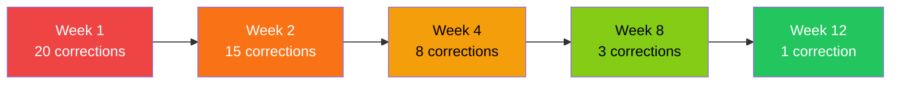

> "80% of my code is written by AI, 20% is spent reviewing and correcting it." — Andrej Karpathy

The self-correction loop optimizes for this ratio. Every correction becomes a rule that prevents future mistakes. After 50 sessions, Claude barely needs correcting.

## How It Works

<Steps>
  <Step title="You correct Claude">
    Point out a mistake or suboptimal behavior
  </Step>
  <Step title="Claude acknowledges specifically">
    Explains exactly what went wrong
  </Step>
  <Step title="Claude proposes a rule">
    Formats as `[LEARN] Category: One-line rule`
  </Step>
  <Step title="You approve">
    Say "yes", "approved", or "add it"
  </Step>
  <Step title="Rule goes into LEARNED section">
    Persists across all future sessions
  </Step>
</Steps>

## Example Flow

```text
User: You edited the wrong file

Claude: I edited src/utils.ts when you meant src/lib/utils.ts.

[LEARN] Navigation: Confirm full path before editing files with common names.

Should I add this?

User: yes

Claude: Added to LEARNED section. I'll confirm paths before editing from now on.
```

## Setup

Add this to your `CLAUDE.md`:

```markdown
## Self-Correction Protocol

When the user corrects me or I make a mistake:
1. Acknowledge specifically what went wrong
2. Propose a concise rule: `[LEARN] Category: One-line rule`
3. Wait for approval before adding to LEARNED section

### LEARNED
<!-- Auto-populated through corrections -->
```

<Note>
  The LEARNED section starts empty and grows as you work together.
</Note>

## Trigger Phrases

These phrases activate the learning protocol:

- "Add that to your rules"
- "Remember this"
- "Don't do that again"
- "Learn from this"
- "Make this a rule"

## Learning Categories

Organize rules by category for easier maintenance:

<Tabs>
  <Tab title="Navigation">
    Rules about finding and accessing files
    
    ```markdown
    [LEARN] Navigation: Confirm full path before editing files with common names
    [LEARN] Navigation: Check parent directory exists before mkdir
    [LEARN] Navigation: Use Glob to find files, not assumptions
    ```
  </Tab>
  
  <Tab title="Code Quality">
    Rules about code style and quality
    
    ```markdown
    [LEARN] Code Quality: Remove console.log before committing
    [LEARN] Code Quality: Prefer existing patterns over new abstractions
    [LEARN] Code Quality: Run typecheck after interface changes
    ```
  </Tab>
  
  <Tab title="Testing">
    Rules about test practices
    
    ```markdown
    [LEARN] Testing: Run tests after each file change, not in batch
    [LEARN] Testing: Test edge cases explicitly, not just happy path
    [LEARN] Testing: Mock external APIs in unit tests
    ```
  </Tab>
  
  <Tab title="Git">
    Rules about version control
    
    ```markdown
    [LEARN] Git: Run quality gates before commit
    [LEARN] Git: Use conventional commit format
    [LEARN] Git: Check for uncommitted changes before branch switch
    ```
  </Tab>
</Tabs>

## Rule Format

Good rules are:

<Check>**Specific**: "Confirm full path before editing files with common names"</Check>
<Check>**Actionable**: "Run typecheck after interface changes"</Check>
<Check>**Concise**: One line, clear directive</Check>
<Check>**Categorized**: Grouped for easy scanning</Check>

<X>**Vague**: "Be more careful with files"</X>
<X>**Verbose**: Long explanations with multiple clauses</X>
<X>**Uncategorized**: Random order, hard to find</X>

## Correction Workflow

When you notice a mistake:

<CodeGroup>
```text Simple Correction
User: You forgot to run the tests

Claude: You're right. I made changes without verifying them.

[LEARN] Testing: Run relevant tests after each file change

Should I add this to LEARNED?
```

```text Correction with Context
User: This breaks our API convention—we use camelCase not snake_case

Claude: I used snake_case for the endpoint when the project uses camelCase.

[LEARN] Code Quality: Follow camelCase convention for API endpoints

Should I add this?
```

```text Pattern Recognition
User: Same mistake as last time—you edited without reading first

Claude: I edited the file without reading it first, missing the existing pattern.
This is the second time I've made this mistake.

[LEARN] Workflow: Always Read files before Edit to understand existing patterns

Adding this now.
```
</CodeGroup>

## Compound Improvement

The magic happens over time:



Each correction prevents similar future mistakes. After 50 sessions, corrections drop by 80%.

## Database Integration

Pro Workflow stores learnings in SQLite with full-text search:

```bash
# Search all learnings
/search testing

# Search exact phrase
/search "file paths"

# List all learnings
/list

# Surface relevant learnings
/replay <topic>
```

<Tip>
  The `/replay` command automatically surfaces past learnings relevant to your current task.
</Tip>

## Hook Integration

Hooks automatically prompt for learnings:

**SessionEnd Hook**
```json
{
  "hooks": {
    "SessionEnd": "Review session. Any corrections to capture as [LEARN] rules?"
  }
}
```

**PostToolUse Hook** (after test failures)
```json
{
  "hooks": {
    "PostToolUse": "If tests failed, suggest [LEARN] pattern to prevent similar failures"
  }
}
```

## Learning from Test Failures

When tests fail:

```text
Test failed: Expected camelCase, got snake_case

Claude: The test failed because I used snake_case instead of camelCase.

[LEARN] Code Quality: Project uses camelCase for all identifiers

Should I add this?
```

<Warning>
  Don't add learnings for one-off issues. Only capture patterns that will recur.
</Warning>

## Pruning Stale Rules

Review your LEARNED section weekly:

**Remove if:**
- The pattern changed (no longer relevant)
- Too specific to one file
- Redundant with another rule
- Never actually applied

**Keep if:**
- Applied frequently
- Prevents common mistakes
- Represents project conventions
- Clarifies ambiguous situations

## Split Memory Pattern

For large projects, split learnings into categories:

```text
.claude/
├── CLAUDE.md          # Entry point
├── LEARNED.md         # General learnings
├── AGENTS.md          # Workflow learnings
└── SOUL.md            # Style preferences
```

**CLAUDE.md** imports them:

```markdown
# MyProject

## Learnings
!cat .claude/LEARNED.md

## Agent Rules
!cat .claude/AGENTS.md

## Style Guide
!cat .claude/SOUL.md
```

## Analytics and Insights

Track correction patterns:

```bash
/insights
```

Shows:
- **Correction frequency** over time
- **Hot categories** (most corrections)
- **Cold rules** (learned but never applied)
- **Improvement trajectory** (fewer corrections over time)

## Examples from Production Use

<AccordionGroup>
  <Accordion title="Navigation Learnings">
    ```markdown
    [LEARN] Navigation: Use Glob to find files, never assume locations
    [LEARN] Navigation: Confirm parent directory exists before mkdir
    [LEARN] Navigation: Check full path before editing files with common names like utils.ts
    [LEARN] Navigation: Verify file exists before Read, handle gracefully if not
    ```
  </Accordion>
  
  <Accordion title="Testing Learnings">
    ```markdown
    [LEARN] Testing: Run tests after each file change, not in batch at end
    [LEARN] Testing: Test error cases explicitly, not just happy paths
    [LEARN] Testing: Mock external dependencies (APIs, databases) in unit tests
    [LEARN] Testing: Check test coverage increased, not decreased
    ```
  </Accordion>
  
  <Accordion title="Git Learnings">
    ```markdown
    [LEARN] Git: Run lint + typecheck + test before commit
    [LEARN] Git: Use conventional commit format: type(scope): message
    [LEARN] Git: Check for uncommitted changes before branch operations
    [LEARN] Git: Never commit console.log, debugger, or TODO comments
    ```
  </Accordion>
  
  <Accordion title="Quality Learnings">
    ```markdown
    [LEARN] Quality: Read existing code before writing new patterns
    [LEARN] Quality: Prefer existing patterns over new abstractions
    [LEARN] Quality: Remove unused imports after refactoring
    [LEARN] Quality: Update tests when interface changes
    ```
  </Accordion>
</AccordionGroup>

## Best Practices

### Do

<Check>Capture corrections immediately while fresh</Check>
<Check>Use specific, actionable language</Check>
<Check>Organize by category for easy scanning</Check>
<Check>Review and prune weekly</Check>
<Check>Use `/replay` to surface relevant learnings</Check>

### Don't

<X>Add learnings for one-off issues</X>
<X>Write vague or verbose rules</X>
<X>Let LEARNED grow unbounded</X>
<X>Keep rules that never get applied</X>
<X>Skip the approval step (verify intent)</X>

## Integration with Workflows

The self-correction loop integrates with:

**Multi-Phase Development**
- Capture learnings at the end of each feature
- Review corrections during wrap-up

**Wrap-Up Ritual**
- `/wrap-up` prompts for learnings
- Surface corrections from the session

**Agent Teams**
- Each agent can propose learnings
- Lead consolidates into LEARNED section

## Next Steps

<CardGroup cols={2}>
  <Card title="80/20 Review" icon="magnifying-glass" href="/concepts/80-20-review">
    Learn when to review and when to trust
  </Card>
  <Card title="Multi-Phase Development" icon="timeline" href="/concepts/multi-phase-development">
    Apply learnings in structured workflows
  </Card>
</CardGroup>