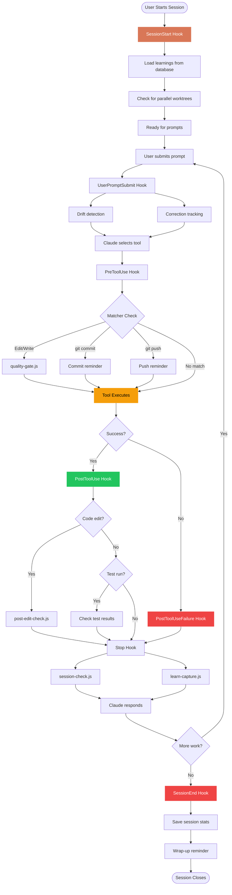
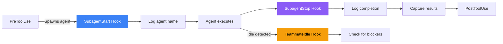
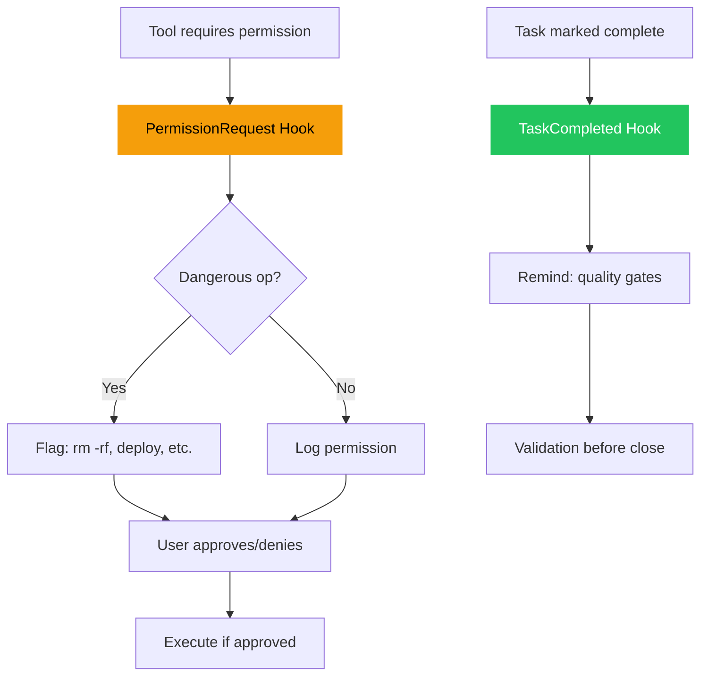

## Hook Execution Flow

Hooks fire at specific points in the Claude Code workflow. Understanding the lifecycle helps you write effective custom hooks and debug timing issues.

## Session Flow Diagram



## Agent Orchestration Flow

When using agent teams (like `/develop`), additional hooks track subagent lifecycle:



## Permission & Task Flow



## Hook Timing Details

### SessionStart

<Steps>
  <Step title="Trigger">
    Fires **once** when a new Claude Code session begins
  </Step>
  
  <Step title="Execution">
    ```bash
    node "${CLAUDE_PLUGIN_ROOT}/scripts/session-start.js"
    ```
  </Step>
  
  <Step title="Actions">
    1. Check if SQLite database exists
    2. Call `store.startSession(sessionId, projectName)`
    3. Load recent learnings from database (last 5, project-scoped)
    4. Display previous session stats (edit count, corrections)
    5. Check for git worktrees
    6. Output ready message
  </Step>
  
  <Step title="Timing">
    Runs **before** first user prompt. Total execution: ~50-100ms
  </Step>
</Steps>

<CodeGroup>
```javascript Database Available
[ProWorkflow] Loaded 3 learnings from database:
  - [Testing] Always run tests before committing
  - [TypeScript] Check for any types in strict mode
  - [Git] Use conventional commit format
[ProWorkflow] Previous session: 2026-03-07 (12 edits, 2 corrections)
[ProWorkflow] 2 worktrees available for parallel work
[ProWorkflow] Ready. Use /wrap-up before ending, /learn to capture corrections.
```

```javascript Fallback Mode
[ProWorkflow] Loaded 15 learned patterns from LEARNED.md
[ProWorkflow] Previous session: 2026-03-07-abc123.md
[ProWorkflow] Ready. Use /wrap-up before ending, /learn to capture corrections.
```
</CodeGroup>

### PreToolUse (Edit/Write)

<Steps>
  <Step title="Trigger">
    Fires **before** every Edit or Write tool execution
  </Step>
  
  <Step title="Matcher">
    ```json
    "matcher": "tool == \"Edit\" || tool == \"Write\""
    ```
  </Step>
  
  <Step title="Actions">
    1. Increment edit count in database or temp file
    2. Calculate adaptive threshold based on correction rate
    3. Check if current edit count matches checkpoint (5, 10, 20, etc.)
    4. Output reminder if checkpoint reached
  </Step>
  
  <Step title="Example Output">
    ```bash
    [ProWorkflow] 5 edits — checkpoint for review
    [ProWorkflow] Run: git diff --stat | to see changes
    [ProWorkflow] (adaptive: tighter gates due to recent correction rate)
    ```
  </Step>
</Steps>

### PostToolUse (Code Edits)

<Steps>
  <Step title="Trigger">
    Fires **after** successful Edit on code files (ts, tsx, js, jsx, py, go, rs)
  </Step>
  
  <Step title="Matcher">
    ```json
    "matcher": "tool == \"Edit\" && tool_input.file_path matches \"\\\\.(ts|tsx|js|jsx|py|go|rs)$\""
    ```
  </Step>
  
  <Step title="Actions">
    1. Read edited file content
    2. Scan each line for issues:
       - `console.log`, `console.debug`, `console.info`
       - `print()` statements (Python)
       - TODO/FIXME/XXX/HACK comments
       - Hardcoded secrets (api_key, password, token patterns)
    3. Report first 5 issues found
  </Step>
  
  <Step title="Example Output">
    ```bash
    [ProWorkflow] Issues in src/utils.ts:
      42: console.log found
      58: TODO found
      91: Possible hardcoded secret
    [ProWorkflow] Consider: [LEARN] to remember patterns
    ```
  </Step>
</Steps>

### UserPromptSubmit (Drift Detection)

<Steps>
  <Step title="Trigger">
    Fires **on every user prompt** submission
  </Step>
  
  <Step title="Actions">
    1. Extract intent from first user prompt (saved to temp file)
    2. On subsequent prompts:
       - Increment `editsSinceLastTouch` counter
       - Extract keywords from original intent
       - Extract keywords from current prompt
       - Calculate relevance (keyword overlap)
    3. If 6+ edits AND relevance < 20%: **drift alert**
  </Step>
  
  <Step title="Example Output">
    ```bash
    [ProWorkflow] Drift check: 8 edits since original goal
    [ProWorkflow] Original intent: "Add user authentication with JWT tokens"
    [ProWorkflow] Current work seems unrelated — refocusing or intentional tangent?
    ```
  </Step>
</Steps>

### Stop (Learning Capture)

<Steps>
  <Step title="Trigger">
    Fires **after every Claude response** completes
  </Step>
  
  <Step title="Actions">
    1. Parse `assistant_response` for `[LEARN]` blocks using regex:
       ```regex
       /\[LEARN\]\s*([\w][\w\s-]*?)\s*:\s*(.+?)(?:\nMistake:\s*(.+?))?(?:\nCorrection:\s*(.+?))?/gim
       ```
    2. Extract category, rule, mistake (optional), correction (optional)
    3. Save to database via `store.addLearning()`
    4. Output count of auto-saved learnings
  </Step>
  
  <Step title="Example Output">
    ```bash
    [ProWorkflow] Auto-saved 2 learning(s) to database
    ```
  </Step>
</Steps>

<Note>
The `Stop` hook is **passive**—it never interrupts Claude's response. It only extracts learnings that Claude naturally included in the response text.
</Note>

### SessionEnd

<Steps>
  <Step title="Trigger">
    Fires **once** when session closes (Ctrl+C, exit, etc.)
  </Step>
  
  <Step title="Actions">
    1. Retrieve session from database
    2. Call `store.endSession(sessionId)` to mark ended timestamp
    3. Display session summary (edits, corrections, prompts)
    4. Check git status for uncommitted changes
    5. Remind about `/wrap-up` and `/search`
  </Step>
  
  <Step title="Example Output">
    ```bash
    [ProWorkflow] Session saved to database:
      - Edits: 23
      - Corrections: 3
      - Prompts: 15
    [ProWorkflow] WARNING: 7 uncommitted changes!
    [ProWorkflow] Session ending...
    [ProWorkflow] Did you run /wrap-up? Learnings captured?
    [ProWorkflow] Use /search <keyword> to find past learnings
    ```
  </Step>
</Steps>

## Event Sequencing Examples

### Simple Edit Flow

```text
User: "Fix the typo in utils.ts"
  ↓
[UserPromptSubmit] drift-detector.js → Check intent alignment
  ↓
Claude: "I'll use Edit tool"
  ↓
[PreToolUse] quality-gate.js → "1 edit — tracking"
  ↓
Edit tool executes
  ↓
[PostToolUse] post-edit-check.js → Scan for console.log, TODOs
  ↓
[Stop] learn-capture.js → Check for [LEARN] blocks
[Stop] session-check.js → Context-aware reminders
  ↓
Claude: "Fixed the typo"
```

### Multi-Tool Flow with Subagent

```text
User: "/develop add authentication"
  ↓
[UserPromptSubmit] drift-detector.js → Save intent: "add authentication"
  ↓
Claude: "Launching planner agent"
  ↓
[PreToolUse] → Agent spawn detected
  ↓
[SubagentStart] → Log: "Subagent started: planner"
  ↓
Planner agent works
  ↓
[SubagentStop] → Log: "Subagent finished: planner" → Capture results
  ↓
[PreToolUse] quality-gate.js → "1 edit"
  ↓
Claude edits files
  ↓
[PostToolUse] post-edit-check.js → Check issues
  ↓
[TaskCompleted] → "Quality gate check when tasks are marked complete"
  ↓
[Stop] learn-capture.js, session-check.js
```

### Permission Flow

```text
Claude: "I'll run rm -rf node_modules"
  ↓
[PermissionRequest] → Parse command: "rm -rf"
  ↓
Dangerous operation detected
  ↓
Output: "[ProWorkflow] CAUTION: Dangerous operation requested: rm -rf"
  ↓
User approves/denies in dialog
  ↓
If approved → Tool executes → [PostToolUse]
```

## Hook Execution Order

When multiple hooks match the same event, they execute in **definition order** from `hooks.json`:

```json
"PreToolUse": [
  { "matcher": "tool == 'Edit'", ... },        // Runs 1st
  { "matcher": "tool == 'Bash'", ... },        // Runs 2nd
  { "matcher": "*", ... }                      // Runs 3rd (wildcard)
]
```

<Warning>
If a hook script exits with non-zero status, Claude Code will **still proceed** with tool execution. Hooks are advisory, not blocking.
</Warning>

## Performance Considerations

| Hook | Avg Execution Time | Notes |
|------|-------------------|-------|
| SessionStart | 50-100ms | Database query for learnings |
| PreToolUse (quality-gate) | 10-20ms | Simple counter increment |
| PostToolUse (post-edit-check) | 20-50ms | File read + regex scan |
| UserPromptSubmit (drift) | 5-10ms | Keyword extraction |
| Stop (learn-capture) | 10-30ms | Regex parse + DB insert |
| SessionEnd | 30-60ms | DB update + git status check |

<Note>
All hooks run **asynchronously** and don't block Claude's response. Even if a hook takes 100ms, the user experience is unaffected.
</Note>

## Debugging Hooks

To see hook output in real-time:

```bash
# Run Claude Code with verbose logging
claude --log-level debug

# Or check hook script directly
node scripts/quality-gate.js
```

All hooks write to `stderr` with `[ProWorkflow]` prefix, so they're visible in the terminal but don't interfere with tool JSON output.

## Next Steps

<CardGroup cols={2}>
  <Card title="Overview" href="/hooks/overview" icon="webhook">
    Complete reference of all 18 hook events
  </Card>
  <Card title="Custom Hooks" href="/hooks/custom-hooks" icon="code">
    Write your own hooks with matchers and scripts
  </Card>
</CardGroup>