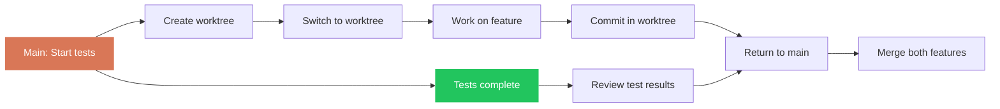

## Overview

Parallel Worktrees enables zero dead time in your coding workflow. While one session runs tests, compiles code, or explores approaches, work on something else in a parallel worktree.

<Note>
**Zero dead time.** While one Claude thinks, work on something else.
</Note>

## Trigger

Use when:
- Waiting on tests (2+ minutes)
- Long builds or compilation
- Exploring multiple approaches simultaneously
- Needing to review and develop at the same time
- Blocked on CI/CD pipeline

<CodeGroup>
```bash Claude Code
claude --worktree    # or claude -w (auto-creates isolated worktree)
```

```bash Cursor / Any Editor
git worktree add ../project-feat feature-branch
# Open the new worktree folder in a second editor window
```
</CodeGroup>

## Quick Start

### Claude Code

```bash
# Create isolated worktree and start session
claude -w

# Claude Code auto-creates, manages, and cleans up the worktree
# Each session gets its own isolated working copy
```

**Key features (Claude Code-specific):**
- `claude -w` auto-creates and cleans up worktrees
- Subagents support `isolation: worktree` in agent frontmatter
- `Ctrl+F` kills all background agents (two-press confirmation)
- `Ctrl+B` sends a task to background

### Cursor / Any Editor

```bash
# Manually create worktrees
git worktree add ../project-feat feature-branch
git worktree add ../project-fix bugfix-branch

# Open each worktree in a separate editor window
code ../project-feat
code ../project-fix
```

Both approaches create isolated working copies where changes don't interfere with your main session.

## Workflow

<Steps>
  <Step title="Show Current Worktrees">
    Check what worktrees already exist
    
    ```bash
    git worktree list
    ```
    
    Output:
    ```text
    /Users/you/project       a3f5c21 [main]
    /Users/you/project-feat  b7d4e92 [feature-branch]
    /Users/you/project-fix   c8e1a43 [bugfix-branch]
    ```
  </Step>
  
  <Step title="Create Worktree">
    Add a new worktree for the parallel task
    
    ```bash
    # From existing branch
    git worktree add ../project-feat feature-branch
    
    # Create new branch
    git worktree add ../project-exp -b experiment
    
    # From specific commit
    git worktree add ../project-old abc123
    ```
  </Step>
  
  <Step title="Open New Session">
    Start a new editor/terminal session in the worktree
    
    ```bash
    cd ../project-feat
    claude  # or open in Cursor
    ```
  </Step>
  
  <Step title="Work Independently">
    Both sessions work independently:
    - Separate working directories
    - Separate git state (staged changes, current branch)
    - Separate editor state
    - Shared git history and config
  </Step>
  
  <Step title="Clean Up When Done">
    Remove worktree after completing work
    
    ```bash
    # Check for uncommitted changes first
    git -C ../project-feat status
    
    # Remove worktree
    git worktree remove ../project-feat
    
    # Clean up stale references
    git worktree prune
    ```
  </Step>
</Steps>

## Usage Pattern

### Terminal Layout

```text
Terminal 1: ~/project          → Main work (feature development)
Terminal 2: ~/project-feat     → Feature branch (parallel feature)
Terminal 3: ~/project-fix      → Bug fixes (urgent fix while tests run)
```

Each terminal runs its own AI session independently.

### Typical Workflow



## When to Parallelize

| Scenario | Action |
|----------|--------|
| **Tests running (2+ min)** | Start new feature in worktree |
| **Long build** | Debug issue in parallel |
| **Exploring approaches** | Compare 2-3 simultaneously |
| **Review + new work** | Reviewer in one, dev in other |
| **Waiting on CI** | Start next task in worktree |
| **Context switching** | Keep both contexts alive |

## Commands

### Create Worktrees

```bash
# From existing branch
git worktree add ../project-feat feature-branch

# Create new branch
git worktree add ../project-exp -b experiment

# From specific commit
git worktree add ../project-hotfix abc123 -b hotfix/critical-bug

# With custom path
git worktree add /tmp/project-temp main
```

### List Worktrees

```bash
git worktree list

# Verbose (show locked status)
git worktree list --porcelain
```

### Remove Worktrees

```bash
# Remove specific worktree
git worktree remove ../project-feat

# Force remove (even with uncommitted changes)
git worktree remove ../project-feat --force

# Clean up stale references
git worktree prune
```

### Check Worktree Status

```bash
# From any location
git -C ../project-feat status
git -C ../project-feat log --oneline -5
```

## Claude Code Extras

These features are Claude Code-specific (skip if using Cursor):

### Auto-Managed Worktrees

```bash
# Claude Code handles everything
claude -w

# Behind the scenes:
# 1. Creates worktree in temp location
# 2. Checks out current or new branch
# 3. Opens session in worktree
# 4. Cleans up on exit
```

### Background Agent Management

```bash
# Send current task to background
Ctrl+B

# Kill all background agents
Ctrl+F  # Press twice to confirm

# Background agents appear in session list
claude sessions
```

### Subagent Worktree Isolation

In agent frontmatter:

```yaml
---
name: scout
description: Explore codebase for patterns
background: true
isolation: worktree
---
```

**Benefits:**
- Scout agent gets its own worktree automatically
- No interference with main session
- Can make exploratory changes safely
- Auto-cleanup when agent completes

## Guardrails

<Warning>
**Important worktree rules:**
</Warning>

<AccordionGroup>
  <Accordion title="Each worktree is a full working copy" icon="copy">
    Changes are isolated. Commits in one worktree don't appear in another until pushed/pulled.
  </Accordion>
  
  <Accordion title="Check for uncommitted changes" icon="file-circle-question">
    Before removing a worktree, verify no uncommitted work:
    
    ```bash
    git -C ../project-feat status
    ```
  </Accordion>
  
  <Accordion title="Clean up worktrees when done" icon="broom">
    Don't forget to remove worktrees:
    
    ```bash
    git worktree prune
    ```
    
    Stale worktree references can cause confusion.
  </Accordion>
  
  <Accordion title="Avoid editing same files" icon="triangle-exclamation">
    Don't edit the same files in multiple worktrees simultaneously. Last commit wins, others will conflict.
  </Accordion>
  
  <Accordion title="Branches can't be checked out twice" icon="lock">
    Git won't let you checkout the same branch in multiple worktrees:
    
    ```bash
    # Error: 'main' is already checked out at '/Users/you/project'
    git worktree add ../project-2 main
    ```
  </Accordion>
</AccordionGroup>

## Examples

### Example 1: Tests Running

```bash
# Terminal 1: Main session
$ npm test
# ... tests running (2 minutes) ...

# Terminal 2: Create worktree for parallel work
$ git worktree add ../project-feat -b feat/new-endpoint
Preparing worktree (new branch 'feat/new-endpoint')
HEAD is now at a3f5c21 feat: add user auth

$ cd ../project-feat
$ claude

Claude: What should we work on?

User: Implement the new API endpoint for user preferences

Claude: [Implements feature while tests run in main session]

# Terminal 1: Tests complete
✓ All tests passed

# Return to main session, handle test results
# Worktree session continues independently
```

### Example 2: Exploring Approaches

```bash
# Try 3 different approaches in parallel

$ git worktree add ../project-approach-1 -b experiment/approach-1
$ git worktree add ../project-approach-2 -b experiment/approach-2
$ git worktree add ../project-approach-3 -b experiment/approach-3

# Open each in separate terminal/editor
# Implement different solutions
# Compare results, keep the best one
# Delete the others

$ git worktree remove ../project-approach-2
$ git worktree remove ../project-approach-3
$ git branch -D experiment/approach-2 experiment/approach-3
```

### Example 3: Review + Development

```bash
# Terminal 1: Review PR in read-only worktree
$ git worktree add ../project-review pr-branch
$ cd ../project-review
$ claude

Claude: Reviewing PR changes in read-only mode...

# Terminal 2: Continue development on main branch
$ cd ~/project
$ claude

Claude: Implementing new feature...

# Both sessions work independently
```

### Example 4: Urgent Hotfix

```bash
# Main session working on feature
$ cd ~/project
# ... feature development in progress ...

# Urgent bug report comes in
$ git worktree add ../project-hotfix -b hotfix/critical-bug main
$ cd ../project-hotfix
$ claude

User: Fix the critical authentication bug

Claude: [Fixes bug, tests, commits]

$ git push origin hotfix/critical-bug
# Create PR for immediate merge

# Return to main session, continue feature work
$ cd ~/project
```

## Integration with Pro Workflow

<CardGroup cols={2}>
  <Card title="Smart Commit" icon="code-commit" href="/skills/smart-commit">
    Each worktree commits independently with quality gates
  </Card>
  <Card title="Wrap-Up" icon="check-circle" href="/skills/wrap-up">
    Wrap up each worktree session before cleanup
  </Card>
  <Card title="Orchestrate" icon="diagram-project" href="/skills/orchestrate">
    Background agents use worktree isolation automatically
  </Card>
  <Card title="Context Optimizer" icon="gauge-high" href="/skills/context-optimizer">
    Worktrees keep context isolated and manageable
  </Card>
</CardGroup>

## Best Practices

<AccordionGroup>
  <Accordion title="Name worktrees clearly" icon="tag">
    Use descriptive paths:
    - Good: `../project-feat/add-oauth`
    - Bad: `../temp`, `../test`
  </Accordion>
  
  <Accordion title="One worktree per logical task" icon="list-check">
    Don't create worktrees for every tiny change. Use for:
    - Parallel features taking >5 minutes
    - Exploring different approaches
    - Urgent context switches
  </Accordion>
  
  <Accordion title="Clean up regularly" icon="broom">
    Weekly:
    ```bash
    git worktree list
    git worktree prune
    ```
  </Accordion>
  
  <Accordion title="Commit before switching" icon="code-commit">
    Always commit or stash in one worktree before creating another. Keeps state clean.
  </Accordion>
</AccordionGroup>

## Troubleshooting

### Can't Create Worktree - Branch Already Checked Out

```bash
# Error: 'feature-branch' is already checked out at '/Users/you/project'

# Solution: Use a different branch or create new branch
git worktree add ../project-feat -b feature-branch-2
```

### Worktree Not Cleaning Up

```bash
# Force remove
git worktree remove ../project-feat --force

# Then prune
git worktree prune
```

### Lost Track of Worktrees

```bash
# List all worktrees
git worktree list

# Remove all except main
git worktree list | grep -v "$(pwd)" | awk '{print $1}' | xargs -I {} git worktree remove {}
```

### Disk Space Issues

Each worktree is a full working copy:

```bash
# Check disk usage
du -sh ../project*

# Clean up node_modules in worktrees
find ../project-* -name "node_modules" -type d -prune -exec rm -rf {} +
```

## Advanced: Subagent Worktree Patterns

### Scout Agent (Background, Worktree)

```yaml
---
name: scout
description: PROACTIVELY explore codebase when confidence is low
tools: ["Read", "Glob", "Grep"]
background: true
isolation: worktree
model: haiku
---

You are a scout agent. Explore the codebase to:
1. Find similar patterns
2. Identify relevant files
3. Score confidence (0-100)
4. Report back with findings

Never make changes. Read-only exploration.
```

### Reviewer Agent (Worktree)

```yaml
---
name: reviewer
description: Code review with security focus
tools: ["Read", "Grep", "Bash"]
isolation: worktree
model: opus
---

Review changes in this worktree:
1. Security vulnerabilities
2. Performance issues
3. Test coverage
4. Code quality

Never modify code. Report findings only.
```

## Next Steps

<CardGroup cols={2}>
  <Card title="Master Pro Workflow" icon="star" href="/skills/pro-workflow">
    See how parallel worktrees fit into the complete system
  </Card>
  <Card title="Try Orchestrate" icon="diagram-project" href="/skills/orchestrate">
    Use worktrees with multi-phase development
  </Card>
  <Card title="Optimize Context" icon="gauge-high" href="/skills/context-optimizer">
    Keep context clean with worktree isolation
  </Card>
  <Card title="Explore All Skills" icon="puzzle-piece" href="/skills/overview">
    View the complete skill system
  </Card>
</CardGroup>